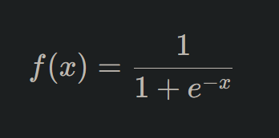
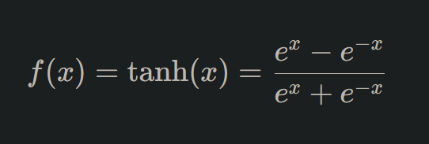
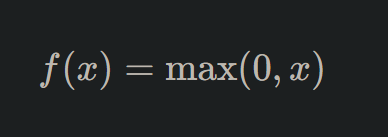
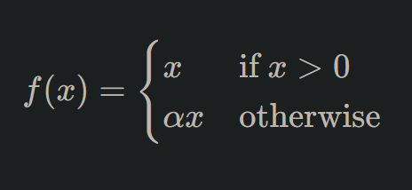

# Deep Learning: Activation Functions

## **Unraveling Activation Functions**

Every deep learning enthusiast will inevitably encounter activation functions. These pivotal elements dictate how information flows through a neural network, determining the output of a neuron given its input. Think of activation functions as gatekeepers, deciding which information should pass forward and which should be subdued.

### **Why Activation Functions Matter**

Without activation functions, neural networks would be mere linear regressors, limited in their capacity to learn from data. Activation functions introduce the non-linearity required for the network to learn complex patterns, enabling deep learning models to solve intricate tasks from image recognition to natural language processing.

## **The Role of Activation Functions**

A neuron in a neural network calculates a weighted sum of its inputs. The activation function takes this sum as input and produces an output, determining the final result of that neuron.

### **Why Not Just Linear Functions?**

While linear functions are simple and easy to understand, they have a significant limitation: no matter how many layers you stack, the final output will still be a linear transformation of the input. Non-linear activation functions allow for richer representations, enabling deep networks to learn from data more effectively.

## **Diving into Popular Activation Functions**

Over the years, researchers have introduced a myriad of activation functions, each with its advantages, quirks, and use-cases.

### **1. Sigmoid**

The sigmoid function, one of the earliest used, produces outputs between 0 and 1. It's expressed mathematically as:

However, the sigmoid function can cause vanishing gradient problems, where the gradients become too small for the network to learn effectively.

### **2. Hyperbolic Tangent (Tanh)**

Similar in shape to the sigmoid but with outputs ranging from -1 to 1, the tanh function is defined as:

It offers a zero-centered output, making it preferred over the sigmoid in many cases.

### **3. Rectified Linear Unit (ReLU)**

Arguably the most popular activation function in recent years, ReLU is simple yet effective. It outputs the input if positive; otherwise, it outputs zero:

Despite its simplicity, ReLU has shown remarkable success in practice, especially in deep networks. However, it can suffer from dead neurons, where certain neurons never activate.

### **4. Leaky ReLU**

A variation of ReLU, Leaky ReLU allows a small gradient when the unit is not active, addressing the dead neuron issue:

Where **α** is a small constant.

### **5. Softmax**

Primarily used in the output layer of classification tasks, the softmax function converts a vector of numbers into a probability distribution across multiple classes.

## **Choosing the Right Activation Function**

The choice of activation function can influence a model's performance and training dynamics. Considerations include:

1. **Network Depth**: Deeper networks might benefit from ReLU and its variants.
2. **Task Type**: For binary classification, sigmoid might be suitable for the output layer. For multi-class, softmax is the go-to choice.
3. **Training Dynamics**: If you observe dead neurons or vanishing gradients, you might want to switch or adjust your activation functions.

## **Conclusion: Powering Neural Dynamics**

Activation functions lie at the core of deep learning, shaping the dynamics of neural networks. Their ability to introduce non-linearity empowers deep networks to capture complex patterns, bridging the gap between raw data and meaningful insights. As you delve deeper into the world of neural networks, understanding and experimenting with different activation functions will be integral to your journey. Embrace them, for they are the very heartbeat of deep learning models!

---

!!! note "Version 1.0"

    This is currently an early version of the learning material and it will be updated over time with more detailed information.

    A video will be provided with the learning material as well.

    Be sure to subscribe to stay up-to-date with the latest updates.

    <h2 style="color: white;">Need help mastering Machine Learning?</h2>
    
Don't just follow along — join me!
    Get exclusive access to me, your instructor, who can help answer any of your questions. Additionally, get access to a private learning group where you can learn together and support each other on your AI journey.
    
 
    

        <button style="display: inline-block; padding: 10px 20px; font-size: 20px; color: white; background: #1018A8; border: none; border-radius: 5px;">
            <a href="/subscribe" style="color: white; text-decoration: none;">Subscribe Now</a>
        </button>
    

