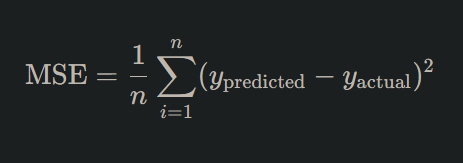

# Deep Learning: Loss Functions

## **Deciphering Loss Functions**

Every aspiring deep learning practitioner should familiarize themselves with loss functions. These critical components gauge how well a neural network's predictions align with actual outcomes. Think of a loss function as a compass guiding a ship: it indicates how off-course the ship is and provides direction for getting back on track.

### **Why Are Loss Functions Essential?**

At the heart of deep learning lies the iterative process of making predictions, evaluating how accurate those predictions are, and refining the model to improve its accuracy. Loss functions provide the metric to assess this accuracy, acting as the guiding light for model optimization.

## **How Does a Loss Function Work?**

In essence, a loss function computes the difference between the predicted outcome and the actual result. The larger this difference, the higher the "loss" or error. During training, deep learning models strive to minimize this error.

### **Loss vs. Cost**

While the terms "loss" and "cost" are often used interchangeably, there's a subtle distinction:

* **Loss**: Refers to the error for a single data point.
* **Cost**: Represents the average loss across the entire dataset.

## **Diving Into Common Loss Functions**

The choice of loss function can hinge on the specific task at hand, be it regression, classification, or something more nuanced.

### **1. Mean Squared Error (MSE)**

Commonly used for regression problems, MSE calculates the average squared difference between predicted and actual values. It's defined as:

Where **n** is the number of data points.

### **2. Cross-Entropy Loss**

Favored for classification tasks, cross-entropy loss measures the dissimilarity between the predicted probability distribution and the actual distribution. It's particularly useful when gauging the performance of models that output probabilities, like classifiers.

### **3. Hinge Loss**

Used primarily with Support Vector Machines and certain neural network classifiers, hinge loss is designed for binary classification tasks. It measures how well an instance is classified and is sensitive to misclassified points.

### **4. Huber Loss**

A blend between MSE and Mean Absolute Error, Huber loss is less sensitive to outliers than MSE. It can be particularly useful for regression tasks where the data might have some anomalies.

## **Regularization: A Special Mention**

While not a loss function in itself, regularization adds a penalty to the loss function, discouraging overly complex models that might overfit the data. Two common forms are:

1. **L1 Regularization**: Adds a penalty equivalent to the absolute magnitude of coefficients.
2. **L2 Regularization**: Adds a penalty based on the square of the magnitude of coefficients.

## **Choosing the Right Loss Function**

The choice of loss function can profoundly impact a model's performance. Here are some guidelines:

1. **Nature of Task**: Regression tasks often employ MSE or Huber loss, while classification tasks might use cross-entropy or hinge loss.
2. **Data Characteristics**: If your data contains many outliers, consider Huber loss over MSE.
3. **Model Complexity**: If you're concerned about overfitting, consider adding regularization to your loss function.

## **Conclusion: The Role of Loss in Learning**

Loss functions act as the North Star in the vast universe of deep learning. By indicating how far a model's predictions are from reality, they provide a clear path for improvement. As you delve deeper into the realms of neural networks and deep learning, a robust understanding of loss functions will be instrumental. Remember, it's not just about making predictions, but making predictions that continually get better. And in this journey of improvement, loss functions are your most trusted companions.

---

!!! note "Version 1.0"

    This is currently an early version of the learning material and it will be updated over time with more detailed information.

    A video will be provided with the learning material as well.

    Be sure to subscribe to stay up-to-date with the latest updates.

    <h2 style="color: white;">Need help mastering Machine Learning?</h2>
    
Don't just follow along — join me!
    Get exclusive access to me, your instructor, who can help answer any of your questions. Additionally, get access to a private learning group where you can learn together and support each other on your AI journey.
    
 
    

        <button style="display: inline-block; padding: 10px 20px; font-size: 20px; color: white; background: #1018A8; border: none; border-radius: 5px;">
            <a href="/subscribe" style="color: white; text-decoration: none;">Subscribe Now</a>
        </button>
    

