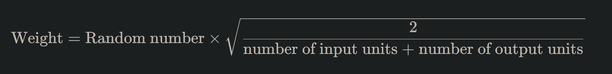
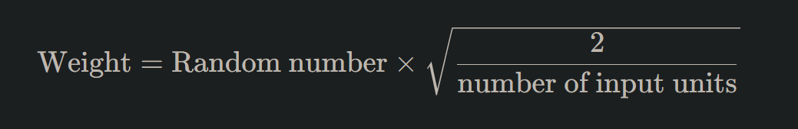
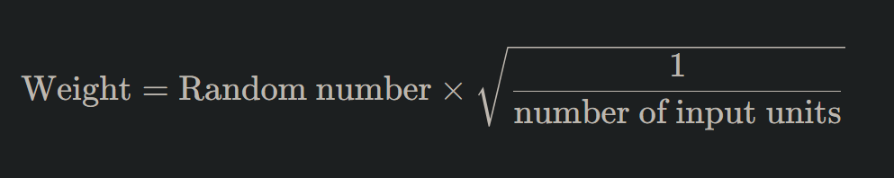

# Deep Learning: Weight Initialization

## **Decoding Weight Initialization**

In the intricate world of deep learning, weight initialization often doesn't get the limelight it deserves. However, how we initialize the weights of neural networks can be the difference between a model that converges swiftly and one that barely learns at all. It's akin to setting the stage before a grand performance; a well-prepared stage often leads to a flawless act.

### **The Significance of Weights in Neural Networks**

Weights, alongside biases, determine how a neural network processes inputs to produce outputs. They adjust during training to minimize the error in predictions. Starting with the right initial weights can set the trajectory for smoother and faster learning.

## **The Perils of Poor Weight Initialization**

Imagine starting a journey with no map or a faulty one. You'd likely wander aimlessly. Similarly, poor weight initialization can lead to:

### **1. Slow Convergence**

Weights that are too small can cause the gradients to be tiny, slowing down the learning process.

### **2. Vanishing & Exploding Gradients**

Improper weights can cause gradients to become exceedingly small (vanish) or excessively large (explode), making training unstable.

### **3. Getting Stuck in Local Minima**

Poor initialization can trap the model in local optima, preventing it from achieving the best possible results.

## **Strategies for Effective Weight Initialization**

Over the years, researchers have proposed various methods to initialize weights effectively, ensuring neural networks start on the right foot.

### **1. Zero Initialization**

While it might seem intuitive to start with all weights as zeros, this approach is flawed. It makes every neuron in the network perform the same operation, rendering deep networks useless.

### **2. Random Initialization**

Here, weights are initialized with small random numbers. While better than zero initialization, it doesn't always ensure optimal learning, especially in deep networks.

### **3. Xavier/Glorot Initialization**

Specially designed for the sigmoid and hyperbolic tangent (tanh) activation functions, Xavier initialization sets the weights according to the number of input and output units. It's mathematically defined as:

### **4. He Initialization**

Tailored for ReLU (Rectified Linear Units) and its variants, He initialization is similar to Xavier but considers only the number of input units:

### **5. LeCun Initialization**

Optimized for the sigmoid and hyperbolic tangent (tanh) functions, LeCun initialization is defined as:

## **Bias Initialization**

While weights often steal the show, biases too play a vital role. Commonly, biases are initialized to zero, as the asymmetry breaking is typically provided by the weights. However, in some architectures or with specific activation functions, small constant values, like 0.01, are used.

## **Putting It All into Practice**

In modern deep learning frameworks like TensorFlow and PyTorch, these initialization methods are built-in, making it easy for practitioners to employ them. However, understanding the underlying principles can guide informed decisions, especially when designing custom architectures.

## **Conclusion: Starting Strong with Weight Initialization**

In the grand theatre of deep learning, weight initialization sets the stage for a model's performance. A thoughtful initialization can be the catalyst for rapid and stable training. As you sculpt neural networks and dive deeper into the nuances of deep learning, always remember: a strong foundation paves the way for monumental success. Embark on your deep learning voyage with the right weight initialization, and witness your models soar to unprecedented heights!

---

!!! note "Version 1.0"

    This is currently an early version of the learning material and it will be updated over time with more detailed information.

    A video will be provided with the learning material as well.

    Be sure to subscribe to stay up-to-date with the latest updates.

    <h2 style="color: white;">Need help mastering Machine Learning?</h2>
    
Don't just follow along — join me!
    Get exclusive access to me, your instructor, who can help answer any of your questions. Additionally, get access to a private learning group where you can learn together and support each other on your AI journey.
    
 
    

        <button style="display: inline-block; padding: 10px 20px; font-size: 20px; color: white; background: #1018A8; border: none; border-radius: 5px;">
            <a href="/subscribe" style="color: white; text-decoration: none;">Subscribe Now</a>
        </button>
    

