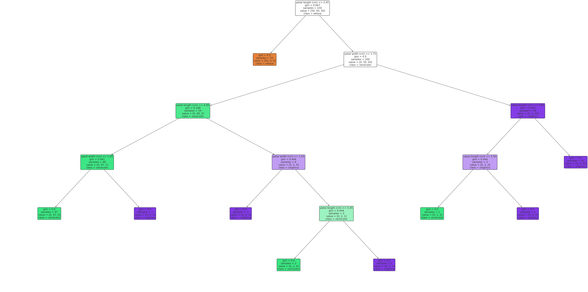

# Machine Learning: Decision Trees

## **What is Decision Trees?**

In the vast expanse of machine learning algorithms, **Decision Trees** stand out for their simplicity and visual appeal. Just as the name suggests, a Decision Tree is a tree-like model of decisions and their possible consequences. It's like playing a game of "20 Questions" where each question gets you closer to the answer.

### **The Anatomy of a Decision Tree**

At its core, a Decision Tree is comprised of:

* **Nodes:** Represent the features or attributes.
* **Edges:** Represent the decision rule.
* **Leaves:** Represent the outcome (or the class label in classification tasks).


## **How Does It Work?**

Building a Decision Tree involves dividing the dataset into subsets based on the most significant attributes. This process is done recursively, resulting in a tree-like model of decisions.

### **Choosing the Right Split**

To determine which attribute to split on, various metrics can be used:

* **Gini Impurity:** A measure of misclassification, where a lower value indicates a better split.
* **Entropy:** A measure of data randomness or disorder.
* **Information Gain:** It represents how much information a feature gives us about the class. It's calculated as the difference in entropy before and after the split.

The attribute with the highest Information Gain (or lowest Gini Impurity) is chosen for the split. This process continues recursively until one of the stopping conditions is met, like a maximum tree depth or a minimum number of samples per leaf.

### **Pruning: Keeping the Tree in Check**

Pruning is like trimming a tree. It's a technique to remove or replace branches in the Decision Tree that have little power in predicting the target variable. This helps in reducing the complexity of the tree and combating overfitting.


## **What is it Used For?**

Decision Trees are versatile algorithms with a wide array of applications:

### **Business Decision Making**

Companies use Decision Trees to evaluate business strategies, investment opportunities, and marketing campaigns by simulating different decision pathways.

### **Healthcare**

Medical professionals use them to aid in diagnoses by evaluating symptoms, risk factors, and patient history.

### **Finance**

Banks and financial institutions leverage Decision Trees for credit scoring, determining loan eligibility, and fraud detection.

### **Tech Industry**

In the realm of technology, they play pivotal roles in recommendation systems, chatbots, and user behavior prediction.


## **A Very Detailed Example with Code and Thorough Explanations**

Let's delve deep into a real-world example: **Classifying Iris flowers based on their features**.

### **Setting the Stage**

The Iris dataset is a classic in the machine learning world. It comprises three species of Iris flowers with four features each: sepal length, sepal width, petal length, and petal width.

### **Loading and Preparing the Data**

```python
from sklearn.datasets import load_iris
from sklearn.model_selection import train_test_split

# Load the Iris dataset
data = load_iris()
X, y = data.data, data.target

# Split the data into training and testing sets
X_train, X_test, y_train, y_test = train_test_split(X, y, test_size=0.2, random_state=42)
```

### **Training the Decision Tree Model**

```python
from sklearn.tree import DecisionTreeClassifier

# Initialize the Decision Tree classifier
clf = DecisionTreeClassifier()

# Fit the model to the training data
clf.fit(X_train, y_train)
```

### **Making Predictions and Evaluating the Model**

```python
from sklearn.metrics import accuracy_score

# Predict the class labels for the test set
y_pred = clf.predict(X_test)

# Calculate the accuracy of the model
accuracy = accuracy_score(y_test, y_pred)
print(f"Accuracy: {accuracy * 100:.2f}%")
```

### **Visualizing the Decision Tree**

Visualizing the tree can offer insights into how decisions are made.

```python
from sklearn.tree import plot_tree
import matplotlib.pyplot as plt

plt.figure(figsize=(20,10))
plot_tree(clf, filled=True, feature_names=data.feature_names, class_names=data.target_names, rounded=True)
plt.show()
```


### **Understanding the Outcome**

The visual representation showcases the decisions made by the tree. Each node displays the decision rule, the Gini impurity, the total number of samples, the distribution of samples among classes, and the class prediction. The branches represent the outcome of the decision rule, leading to other decisions or a final prediction (leaf node).

The accuracy metric, in turn, tells us how well our model performs on unseen data. With Decision Trees, it's often beneficial to delve deeper into other metrics and visual evaluations to ensure the model isn't overfitting and captures the underlying patterns of the data effectively.

* * *

In conclusion, Decision Trees offer a harmonious blend of simplicity, interpretability, and power in solving diverse machine learning problems. Whether you're forecasting sales, diagnosing diseases, or classifying flowers, Decision Trees are an essential tool to have in your machine learning arsenal. They serve as a foundation for more advanced algorithms and continue to be a favorite for practitioners across industries.

---

!!! note "Version 1.0"

    This is currently an early version of the learning material and it will be updated over time with more detailed information.

    A video will be provided with the learning material as well.

    Be sure to subscribe to stay up-to-date with the latest updates.

<div style="padding: 20px; color: white; background-color: #0f1624; border-radius: 10px; margin: 10px 0 20px 0; text-align: center;">
    <h2 style="color: white;">Need help mastering Machine Learning?</h2>
    <p style="font-size: 16px;">Don't just follow along — join me!
    Get exclusive access to me, your instructor, who can help answer any of your questions. Additionally, get access to a private learning group where you can learn together and support each other on your AI journey.
    </p><br>
    <div style="text-align: center; margin-bottom: 20px;">
        <button style="display: inline-block; padding: 10px 20px; font-size: 20px; color: white; background: #1018A8; border: none; border-radius: 5px;">
            <a href="/subscribe" style="color: white; text-decoration: none;">Subscribe Now</a>
        </button>
    </div>
</div>