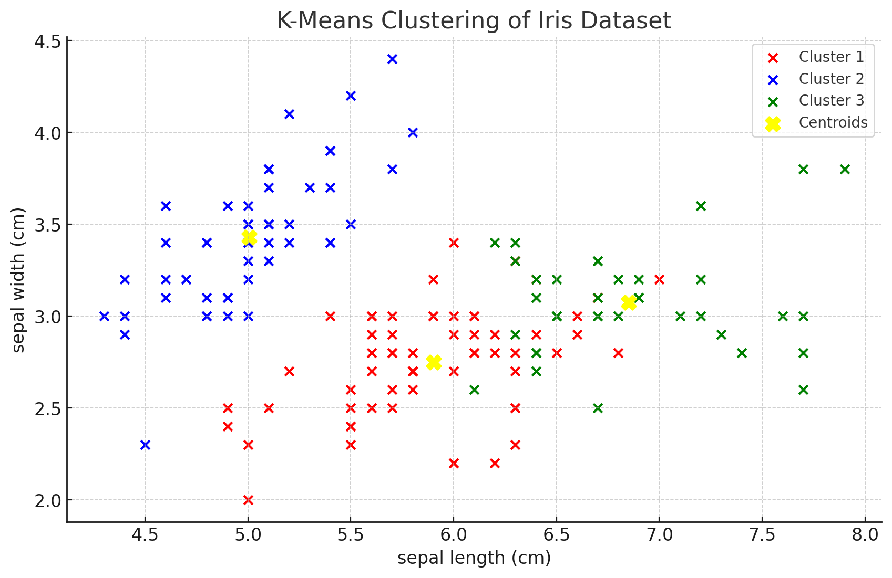

# Machine Learning: K-Means Clustering

## **What is K-Means Clustering?**

**K-Means Clustering** is a popular unsupervised learning algorithm used to partition a dataset into a set of distinct, non-overlapping subgroups or "clusters". The main idea behind K-Means is to classify data points into a predetermined number of clusters based on their inherent properties and characteristics. The data points in each cluster share common attributes, making them distinct from data points in other clusters.

The "K" in K-Means denotes the number of clusters the algorithm will form. It's essential to note that the value of K needs to be specified before running the algorithm.

## **How Does It Work?**

K-Means works by iteratively assigning data points to clusters based on similarity and then recalculating the center of those clusters. Here's a step-by-step breakdown:

### **Initialization**

1. **Randomly select K data points** from the dataset. These points act as the initial centroids of the clusters.
2. Assign each data point in the dataset to the nearest centroid, thereby forming K clusters.

### **Iteration**

1. **Recompute the centroid** of each cluster. The new centroid is the mean of all the data points currently in the cluster.
2. **Reassign each data point** to the nearest centroid. If a data point is closer to a different centroid than its current cluster, it gets reassigned to that cluster.

### **Convergence**

Repeat the iterative process until the centroids no longer change significantly, or a predetermined number of iterations is reached.

## **What is it Used For?**

K-Means Clustering has a plethora of applications across various domains. Some of its popular uses include:

### **Market Segmentation**

Businesses can segment their customer base into different clusters based on purchasing behavior, demographics, or other features. This segmentation can inform targeted marketing strategies.

### **Document Classification**

K-Means can cluster documents based on topics, helping in organizing and categorizing large sets of documents efficiently.

### **Image Compression**

By representing an image in terms of a reduced number of colors (clusters), K-Means can be used for image compression.

### **Anomaly Detection**

In datasets where anomalies or outliers are present, they will typically not belong to any of the main clusters, making K-Means useful for anomaly detection.

## **A Detailed Example with Code**

Let's dive into an example using the famous "Iris" dataset, which contains measurements of 150 iris flowers from three different species.

### **Loading the Data**

```python
from sklearn import datasets
import matplotlib.pyplot as plt

# Load the iris dataset
iris = datasets.load_iris()
data = iris.data
```

### **Implementing K-Means**

We'll use the KMeans class from scikit-learn:

```python
from sklearn.cluster import KMeans

# Using KMeans to create 3 clusters
kmeans = KMeans(n_clusters=3)
kmeans.fit(data)
labels = kmeans.labels_
```

### **Visualizing the Clusters**

Let's plot the data points and color them based on their cluster assignment:

```python
plt.scatter(data[labels == 0, 0], data[labels == 0, 1], label = 'Cluster 1', color = 'red')
plt.scatter(data[labels == 1, 0], data[labels == 1, 1], label = 'Cluster 2', color = 'blue')
plt.scatter(data[labels == 2, 0], data[labels == 2, 1], label = 'Cluster 3', color = 'green')
plt.scatter(kmeans.cluster_centers_[:, 0], kmeans.cluster_centers_[:, 1], s = 100, c = 'yellow', label = 'Centroids')
plt.legend()
plt.title('K-Means Clustering of Iris Dataset')
plt.show()
```


In the visualization, the colored dots represent data points assigned to different clusters, while the yellow dots represent the centroids of the clusters.

### **Interpreting the Results**

The clusters formed by the K-Means algorithm group the iris flowers based on the similarity of their measurements. Although we know there are three species in the dataset, the algorithm doesn't. It simply groups the data into three clusters based on the patterns it detects.

In a real-world scenario, domain expertise would be crucial in interpreting the significance of these clusters and deciding on actionable insights.

## **Wrapping Up**

K-Means Clustering is a powerful and versatile algorithm with applications in various domains. It provides a way to uncover hidden patterns in data and can lead to meaningful insights when used correctly. As with all machine learning techniques, understanding the underlying concepts and the context in which it's applied is crucial for effective results.

---

!!! note "Version 1.0"

    This is currently an early version of the learning material and it will be updated over time with more detailed information.

    A video will be provided with the learning material as well.

    Be sure to subscribe to stay up-to-date with the latest updates.

<div style="padding: 20px; color: white; background-color: #0f1624; border-radius: 10px; margin: 10px 0 20px 0; text-align: center;">
    <h2 style="color: white;">Need help mastering Machine Learning?</h2>
    <p style="font-size: 16px;">Don't just follow along — join me!
    Get exclusive access to me, your instructor, who can help answer any of your questions. Additionally, get access to a private learning group where you can learn together and support each other on your AI journey.
    </p><br>
    <div style="text-align: center; margin-bottom: 20px;">
        <button style="display: inline-block; padding: 10px 20px; font-size: 20px; color: white; background: #1018A8; border: none; border-radius: 5px;">
            <a href="/subscribe" style="color: white; text-decoration: none;">Subscribe Now</a>
        </button>
    </div>
</div>