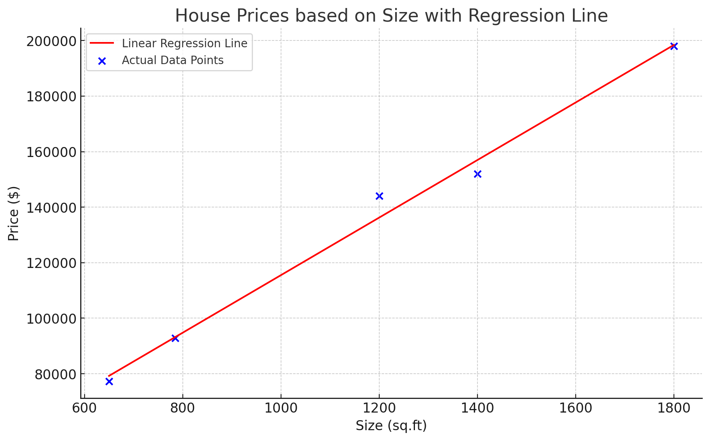

# Machine Learning: Linear Regression

## **What is Linear Regression?**

Linear Regression is one of the most foundational and widely used techniques in the world of machine learning and statistics. At its core, linear regression is a method that models the relationship between a dependent variable and one or more independent variables. This relationship is represented by a straight line, hence the term "linear" regression.

Imagine you have data points on a scatter plot, and you want to draw a straight line that best fits or represents the data. This line is the result of linear regression. The better the line fits the data, the more accurate your predictions will be.


## **How Does It Work?**

Linear regression aims to find the best line that represents the data. This "best fit" line is represented by the equation:

***y = m x + b***

Where:

* **y** is the dependent variable (what we're trying to predict),
* **x** is the independent variable (the input),
* **m** is the slope of the line,
* **b** is the y-intercept.

The primary goal in linear regression is to determine the values of mmm and bbb that minimize the differences (or errors) between the predicted values (points on the line) and the actual data points. This difference is often referred to as the "residual."

To achieve this, a cost function is used, typically the Mean Squared Error (MSE). The MSE measures the average squared difference between the actual data points and the points predicted by our line. Using optimization techniques like gradient descent, the algorithm adjusts the values of mmm and bbb to minimize the MSE, ultimately finding the best fit line.


## **What is Linear Regression Used For?**

Linear regression has a wide variety of applications across multiple domains:

1. **Economics and Finance:** For predicting stock prices, economic trends, and financial forecasting.
2. **Healthcare:** For predicting disease progression or patient outcomes based on various metrics.
3. **Real Estate:** To estimate property prices based on features like location, size, and number of bedrooms.
4. **Sales and Marketing:** To forecast sales, understand factors affecting sales, and predict future revenue.
5. **Environmental Science:** Predicting temperature changes, pollution levels, or any other environment-related metrics based on historical data.

The simplicity and interpretability of linear regression make it a favorite choice, especially when the relationship between the variables is reasonably linear. However, if the relationship is nonlinear, other techniques might be more appropriate.


## **A Detailed Example with Code and Thorough Explanations**

Let's explore a simple example: predicting house prices based on their size.

### **1. Visualizing the Data:**

Before diving into any machine learning model, it's always a good idea to visualize the data to understand its nature.

```python
import matplotlib.pyplot as plt

sizes = [650, 785, 1200, 1400, 1800]
prices = [77250, 92850, 144000, 152000, 198000]

plt.scatter(sizes, prices, color='blue')
plt.xlabel('Size (sq.ft)')
plt.ylabel('Price ($)')
plt.title('House Prices based on Size')
plt.show()
```

### **2. Building the Linear Regression Model:**

For this example, we'll use Python's `scikit-learn` library, which offers a simple interface for linear regression.

```python
from sklearn.linear_model import LinearRegression
import numpy as np

# Reshape the data
sizes_np = np.array(sizes).reshape(-1, 1)
prices_np = np.array(prices)

# Initialize the model
model = LinearRegression()

# Train the model
model.fit(sizes_np, prices_np)
```

### **3. Making Predictions:**

With our model trained, we can predict house prices for new sizes.

```python
# Predicting price for a house of size 1000 sq.ft
predicted_price = model.predict([[1000]])
print(f"Predicted Price for 1000 sq.ft: ${predicted_price[0]:.2f}")
```

### **4. Visualizing the Best Fit Line:**

To understand how well our model has learned, let's visualize the best fit line.

```python
plt.scatter(sizes, prices, color='blue')
plt.plot(sizes, model.predict(sizes_np), color='red')
plt.xlabel('Size (sq.ft)')
plt.ylabel('Price ($)')
plt.title('House Prices based on Size with Regression Line')
plt.show()
```



The red line in the plot is our linear regression model. As you can see, it tries to stay as close as possible to the actual data points, representing the relationship between house size and price.

* * *

In conclusion, linear regression is a powerful yet simple technique for modeling linear relationships between variables. By understanding its fundamentals, you can apply it to a vast array of problems and domains. As with any tool, it's essential to know when to use it and when other, more complex tools might be more appropriate.


---

!!! note "Version 1.0"

    This is currently an early version of the learning material and it will be updated over time with more detailed information.

    A video will be provided with the learning material as well.

    Be sure to subscribe to stay up-to-date with the latest updates.

<div style="padding: 20px; color: white; background-color: #0f1624; border-radius: 10px; margin: 10px 0 20px 0; text-align: center;">
    <h2 style="color: white;">Need help mastering Machine Learning?</h2>
    <p style="font-size: 16px;">Don't just follow along — join me!
    Get exclusive access to me, your instructor, who can help answer any of your questions. Additionally, get access to a private learning group where you can learn together and support each other on your AI journey.
    </p><br>
    <div style="text-align: center; margin-bottom: 20px;">
        <button style="display: inline-block; padding: 10px 20px; font-size: 20px; color: white; background: #1018A8; border: none; border-radius: 5px;">
            <a href="/subscribe" style="color: white; text-decoration: none;">Subscribe Now</a>
        </button>
    </div>
</div>