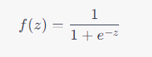

# Machine Learning: Logistic Regression

## **What is Logistic Regression?**

Logistic Regression is a go-to method in the machine learning community, especially when we're dealing with binary classification problems. Unlike its name suggests, it's not a regression algorithm in the traditional sense but rather a classification algorithm used to predict a discrete outcome.

### **Understanding the Basics**

Imagine you want to predict whether it's going to rain tomorrow or not. The outcome is binary: 'Yes, it will rain' or 'No, it won't rain'. Logistic Regression excels at these kinds of problems. Instead of predicting continuous values (like the temperature tomorrow), it predicts the probability of a certain class or event happening.


## **How Does It Work?**

Logistic Regression uses the concept of the odds ratio and the logistic function (often the sigmoid function) to model the relationship between features and the probability of a particular outcome.

### **The Sigmoid Function**

The sigmoid function is defined as:



This function takes in any value and outputs a value between 0 and 1, making it perfect for predicting probabilities.

### **Estimating Probabilities**

Given input features, Logistic Regression calculates a weighted sum of the features (plus a bias term), then applies the sigmoid function to output a probability between 0 and 1. This probability describes the likelihood of an instance belonging to a particular class.

### **Decision Boundary**

Once we have the probability, we can set a threshold (usually 0.5) to classify this probability into one of the two classes. If the probability is above the threshold, it belongs to class 1; otherwise, it belongs to class 0.


## **What is it Used For?**

Logistic Regression is widely employed in various sectors due to its simplicity and efficacy in binary classification tasks.

### **Medical Field**

Doctors can predict the likelihood of a patient having a disease based on certain symptoms or test results.

### **Finance Industry**

Banks can predict if a loan applicant is a high or low credit risk.

### **Marketing Domain**

Companies can predict if a customer will buy a product or not based on their previous behaviors and other demographic factors.

### **Tech World**

Email providers use Logistic Regression to categorize emails as spam or not-spam.


## **A Very Detailed Example with Code and Thorough Explanations**

Let's delve into a hands-on example: **Predicting if a student gets admitted into a university based on their exam scores**.

### **Setting the Stage**

Imagine we have data on students' scores for two exams and information on whether they got admitted. We want to build a model to predict future students' admission chances based on their scores.

### **Loading and Visualizing the Data**

```python
import numpy as np
import matplotlib.pyplot as plt
from sklearn.linear_model import LogisticRegression
from sklearn.model_selection import train_test_split
from sklearn.metrics import accuracy_score

# Sample data (Exam 1 score, Exam 2 score, Admission)
data = np.array([
    [34, 78, 0],
    [54, 79, 0],
    [56, 85, 1],
    [75, 62, 1],
    [85, 90, 1],
    [45, 55, 0]
])

X, y = data[:, :-1], data[:, -1]

# Visualizing the data
plt.scatter(X[y == 1][:, 0], X[y == 1][:, 1], color='blue', label='Admitted')
plt.scatter(X[y == 0][:, 0], X[y == 0][:, 1], color='red', label='Not Admitted')
plt.xlabel('Exam 1 Score')
plt.ylabel('Exam 2 Score')
plt.legend()
plt.show()
```

### **Training the Logistic Regression Model**

```python
# Splitting data
X_train, X_test, y_train, y_test = train_test_split(X, y, test_size=0.2)

# Initializing and training
model = LogisticRegression()
model.fit(X_train, y_train)
```

### **Making Predictions and Assessing the Model**

```python
# Predictions
y_pred = model.predict(X_test)

# Checking the accuracy
accuracy = accuracy_score(y_test, y_pred)
print(f"Model Accuracy: {accuracy * 100:.2f}%")
```

### **Understanding the Outcome**

The Logistic Regression model will use the students' exam scores to estimate the probability of them getting admitted. If the probability is 0.5 or higher, it predicts admission; otherwise, it predicts no admission. The accuracy score gives us an idea of how well our model performs in making these predictions.

* * *

To wrap up, Logistic Regression is a robust and interpretable method for tackling binary classification problems. Its foundation in probability and its capacity to provide probabilities rather than just hard classifications make it an invaluable tool in the machine learning realm. Whether you're forecasting sales, diagnosing diseases, or predicting university admissions, Logistic Regression is a reliable algorithm to have in your repertoire.

---

!!! note "Version 1.0"

    This is currently an early version of the learning material and it will be updated over time with more detailed information.

    A video will be provided with the learning material as well.

    Be sure to subscribe to stay up-to-date with the latest updates.

<div style="padding: 20px; color: white; background-color: #0f1624; border-radius: 10px; margin: 10px 0 20px 0; text-align: center;">
    <h2 style="color: white;">Need help mastering Machine Learning?</h2>
    <p style="font-size: 16px;">Don't just follow along — join me!
    Get exclusive access to me, your instructor, who can help answer any of your questions. Additionally, get access to a private learning group where you can learn together and support each other on your AI journey.
    </p><br>
    <div style="text-align: center; margin-bottom: 20px;">
        <button style="display: inline-block; padding: 10px 20px; font-size: 20px; color: white; background: #1018A8; border: none; border-radius: 5px;">
            <a href="/subscribe" style="color: white; text-decoration: none;">Subscribe Now</a>
        </button>
    </div>
</div>