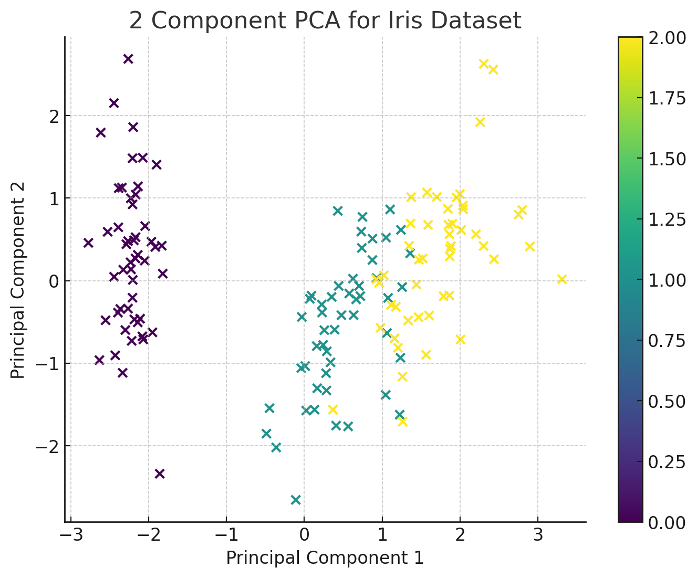

# Machine Learning: Principal Component Analysis

## **What is PCA?**

**Principal Component Analysis (PCA)** is a dimensionality reduction technique used extensively in machine learning and data visualization. The primary goal of PCA is to transform a high-dimensional dataset into a lower-dimensional subspace while retaining as much of the original variance as possible.

In simpler terms, imagine you have a vast table of data with many columns. PCA helps you to simplify that table by creating a new set of columns that still holds most of the information in the original data. These new columns are the "principal components".

## **How Does It Work?**

When you hear "Principal Component Analysis," it might sound complex, but the core idea is about simplifying data. Let's understand this step by step:

### **1. Standardization**

Imagine all data points are in different units, like inches, kilograms, or miles. First, we make sure they all speak the same language by standardizing them, so they have similar scales.

### **2. Find New Directions**

PCA then identifies the direction where data spreads out the most. This direction is the first principal component. Think of it as the main road in a city.

### **3. Find the Next Best Directions**

After the main road, PCA looks for the next significant direction where data varies. This is our second principal component, like a secondary road.

### **4. Reduce Dimensions**

Now, instead of using all old roads (or features), we can use these new main roads (principal components) to represent our city (data). By doing so, we simplify the map but still retain most of its essence.

## **What is it Used For?**

PCA is incredibly versatile and has various applications:

### **Data Visualization**

High-dimensional data is challenging to visualize. By reducing it to 2 or 3 principal components, data can be easily plotted and understood.

### **Noise Reduction**

PCA helps in removing noise from data by focusing only on the most significant patterns in the data.

### **Feature Extraction**

In machine learning, too many features can lead to overfitting. PCA allows for the extraction of the most relevant features, improving model performance.

### **Speeding Up Machine Learning Algorithms**

Some algorithms can be slow due to a high number of features. PCA can accelerate these algorithms by reducing the number of features.

## **A Detailed Example with Code**

Let's dive into an example using the famous "Iris" dataset, which has measurements of 150 iris flowers from three species.

### **Loading the Data**

```python
from sklearn.datasets import load_iris
import pandas as pd

# Load the iris dataset
iris = load_iris()
data = pd.DataFrame(iris.data, columns=iris.feature_names)
```

### **Implementing PCA**

We'll use the PCA class from scikit-learn:

```python
from sklearn.decomposition import PCA

# Standardize the data
from sklearn.preprocessing import StandardScaler
data_standardized = StandardScaler().fit_transform(data)

# Apply PCA and reduce to 2 components for visualization
pca = PCA(n_components=2)
principal_components = pca.fit_transform(data_standardized)
pc_df = pd.DataFrame(data=principal_components, columns=['PC1', 'PC2'])
```

### **Visualizing the Results**

```python
import matplotlib.pyplot as plt

# Plotting the 2D data
plt.figure(figsize=(8, 6))
plt.scatter(pc_df['PC1'], pc_df['PC2'], c=iris.target)
plt.xlabel('Principal Component 1')
plt.ylabel('Principal Component 2')
plt.title('2 Component PCA for Iris Dataset')
plt.colorbar()
plt.grid(True)
plt.show()
```



### **Interpreting the Results**

In the visualization, the different colors represent different species of the iris flowers. The PCA has reduced the dataset's dimensionality while retaining the essence of the original data, as evident from the distinct clusters for different species.

## **Wrapping Up**

PCA is a foundational technique in the world of data science and machine learning. Its ability to simplify complex datasets while preserving their intrinsic patterns makes it invaluable. Whether you're looking to better visualize your data, extract meaningful features, or boost the speed of your algorithms, PCA is a tool you'll find yourself returning to time and time again.

---

!!! note "Version 1.0"

    This is currently an early version of the learning material and it will be updated over time with more detailed information.

    A video will be provided with the learning material as well.

    Be sure to subscribe to stay up-to-date with the latest updates.

<div style="padding: 20px; color: white; background-color: #0f1624; border-radius: 10px; margin: 10px 0 20px 0; text-align: center;">
    <h2 style="color: white;">Need help mastering Machine Learning?</h2>
    <p style="font-size: 16px;">Don't just follow along — join me!
    Get exclusive access to me, your instructor, who can help answer any of your questions. Additionally, get access to a private learning group where you can learn together and support each other on your AI journey.
    </p><br>
    <div style="text-align: center; margin-bottom: 20px;">
        <button style="display: inline-block; padding: 10px 20px; font-size: 20px; color: white; background: #1018A8; border: none; border-radius: 5px;">
            <a href="/subscribe" style="color: white; text-decoration: none;">Subscribe Now</a>
        </button>
    </div>
</div>