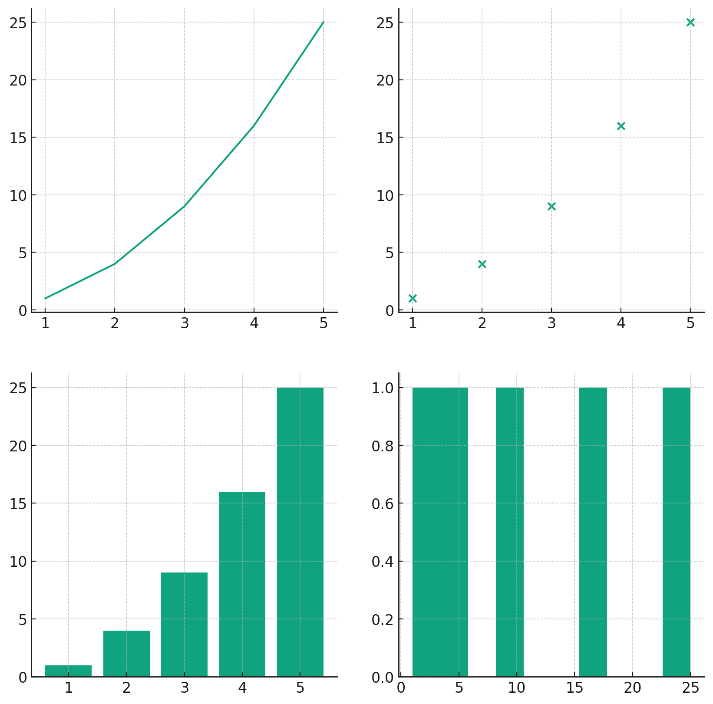
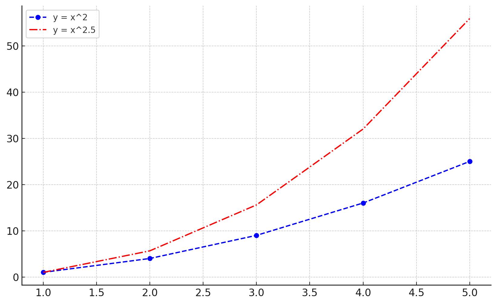
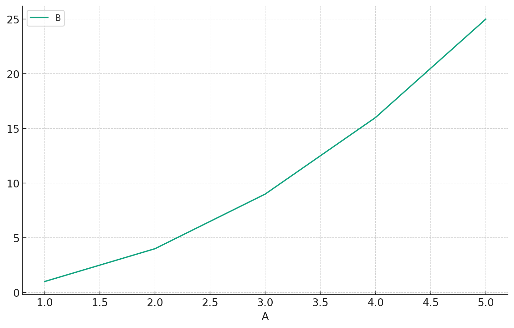
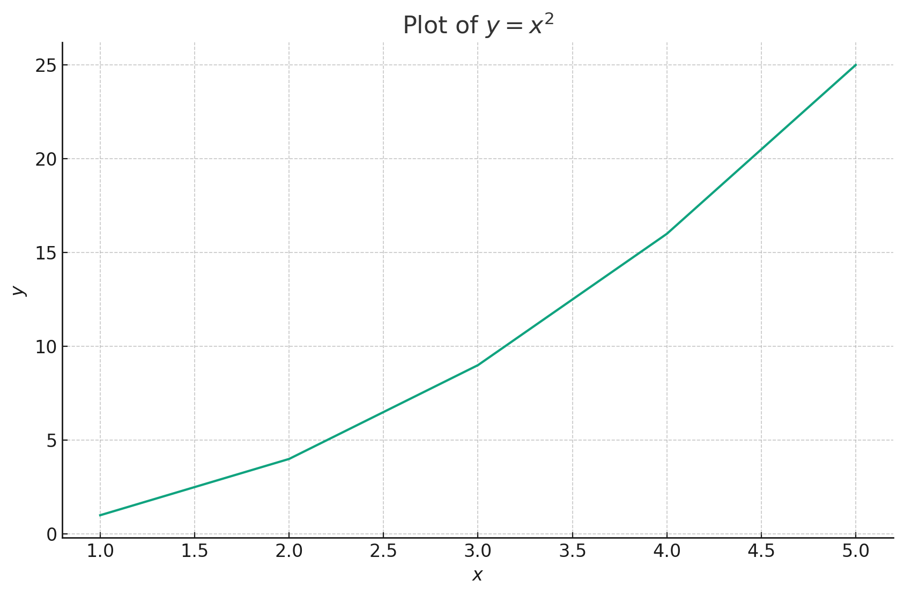

# Matplotlib: Advanced Plotting

## **Deep Dive into Advanced Matplotlib**

Visualization is an art, and with Matplotlib, you are the artist. As you embark on more complex projects within machine learning, the need for sophisticated visualizations becomes increasingly evident. Advanced plotting techniques not only allow you to convey intricate insights but also provide the flexibility to tailor your visuals according to your data's unique requirements. In this tutorial, we'll journey through some of the more advanced aspects of Matplotlib, ensuring you're well-equipped for your machine learning projects.

* * *

## **Subplots**

Subplots allow you to organize multiple plots in a grid-like fashion within a single figure. They are essential when you wish to compare different visualizations side-by-side.

### **Creating Subplots**

To create a 2x2 grid of plots, you can use the `plt.subplots()` function:

```python
fig, axs = plt.subplots(2, 2, figsize=(10, 10))

# Sample data
x = [1, 2, 3, 4, 5]
y = [i**2 for i in x]

# Populating the subplots
axs[0, 0].plot(x, y)
axs[0, 1].scatter(x, y)
axs[1, 0].bar(x, y)
axs[1, 1].hist(y)

plt.show()
```

Let's visualize this arrangement of subplots:



As illustrated, the subplots allow for diverse visualizations in a consolidated manner, making it easier to compare and contrast different views of your data.

* * *

## **Appearance Options**

Ensuring your plots are not only informative but also aesthetically pleasing is crucial. Matplotlib provides a wide array of appearance options to fine-tune every aspect of your visualizations.

### **Customizing Line Styles and Markers**

Different line styles and markers can be employed to differentiate between datasets. Let's explore some of these options:

```python
# Sample data
x = [1, 2, 3, 4, 5]
y1 = [i**2 for i in x]
y2 = [i**2.5 for i in x]

plt.plot(x, y1, color='blue', linestyle='--', marker='o', label='y = x^2')
plt.plot(x, y2, color='red', linestyle='-.', marker='x', label='y = x^2.5')
plt.legend()

plt.show()
```

Here's how these customizations look:



With just a few simple tweaks, the visual distinction between multiple datasets becomes clear, making the plot more insightful for the viewer.

* * *

## **Saving Plots**

Once you've crafted the perfect visualization, you'll often want to save it for presentations, publications, or sharing. Matplotlib provides an easy mechanism to do just that.

### **Saving to File**

To save a plot, use the `savefig` method:

```python
plt.plot(x, y1)
plt.title("Sample Plot")
plt.savefig("sample_plot.png", dpi=300)  # Saves with a resolution of 300 dpi
```

This code snippet will save your plot as a PNG image in the current working directory.

* * *

## **Working with Pandas DataFrames**

Pandas and Matplotlib integrate seamlessly, making it simple to visualize data directly from DataFrames.

### **Plotting from DataFrames**

Assuming you have a DataFrame `df` with columns 'A' and 'B', you can plot them as follows:

```python
import pandas as pd

# Sample DataFrame
data = {'A': x, 'B': y1}
df = pd.DataFrame(data)

df.plot(x='A', y='B', kind='line')

plt.show()
```

Let's visualize a plot using this DataFrame:



This demonstrates the power of integrating Matplotlib with Pandas. By directly plotting from DataFrames, the data visualization process becomes streamlined and efficient.

* * *

## **TeX Markup (Math Symbols)**

For those who need to incorporate mathematical symbols or equations into their plots, Matplotlib supports TeX markup, allowing for the inclusion of mathematical expressions seamlessly.

### **Incorporating Math Symbols**

To embed a mathematical expression, wrap it within `$` symbols:

```python
plt.plot(x, y1)
plt.title(r'Plot of $y = x^2$')  # The 'r' before the string indicates a raw string
plt.xlabel(r'$x$')
plt.ylabel(r'$y$')

plt.show()
```

Let's see how this TeX markup is rendered in a plottt:



The ability to embed TeX markup ensures that your plots can convey complex mathematical relationships with clarity and precision, enhancing the communicative power of your visualizations.

* * *

## **Conclusion**

Advanced plotting with Matplotlib is akin to wielding a finely-tuned instrument. As you delve deeper into machine learning, these advanced techniques will prove invaluable, allowing you to elucidate intricate patterns, relationships, and insights within your data. With the foundational knowledge from this tutorial, you are now well-prepared to craft compelling, informative, and aesthetically pleasing visualizations for any machine learning project that comes your way. Dive in, and let your data shine!

---

!!! note "Version 1.0"

    This is currently an early version of the learning material and it will be updated over time with more detailed information.

    A video will be provided with the learning material as well.

    Be sure to subscribe to stay up-to-date with the latest updates.

<div style="padding: 20px; color: white; background-color: #0f1624; border-radius: 10px; margin: 10px 0 20px 0; text-align: center;">
    <h2 style="color: white;">Need help mastering Machine Learning?</h2>
    <p style="font-size: 16px;">Don't just follow along — join me!
    Get exclusive access to me, your instructor, who can help answer any of your questions. Additionally, get access to a private learning group where you can learn together and support each other on your AI journey.
    </p><br>
    <div style="text-align: center; margin-bottom: 20px;">
        <button style="display: inline-block; padding: 10px 20px; font-size: 20px; color: white; background: #1018A8; border: none; border-radius: 5px;">
            <a href="/subscribe" style="color: white; text-decoration: none;">Subscribe Now</a>
        </button>
    </div>
</div>