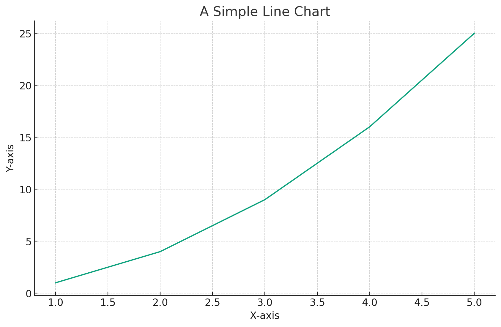
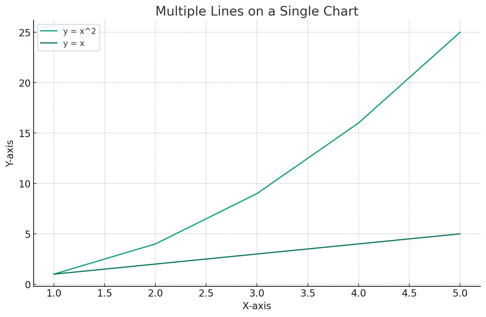
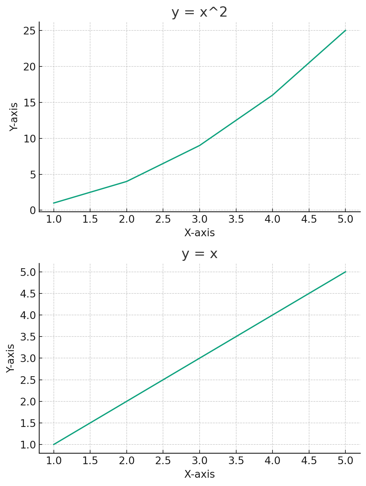

# Matplotlib: Basics

## **Dive into Matplotlib**

Matplotlib is the Swiss Army knife of data visualization in Python. Whether you're working on simple data analysis or diving deep into the complexities of machine learning algorithms, visualizations play a crucial role in understanding and interpreting your data. In this tutorial, we'll explore the foundational aspects of Matplotlib, ensuring you have a solid base to start your data visualization journey.

* * *

## **Importing Matplotlib**

Before we can harness the power of Matplotlib, we need to import it. The most commonly used module in the Matplotlib library is `pyplot`, and it's conventionally imported with the alias `plt`.

```python
import matplotlib.pyplot as plt
```

With this single line of code, a world of data visualization possibilities opens up!

* * *

## **Simple Plotting**

### **Your First Line Chart**

Creating a basic line chart is a breeze with Matplotlib. Let's consider a simple example with a list of numbers:

```python
# Sample data
x = [1, 2, 3, 4, 5]
y = [1, 4, 9, 16, 25]

# Plotting the data
plt.plot(x, y)

# Adding title and labels
plt.title("A Simple Line Chart")
plt.xlabel("X-axis")
plt.ylabel("Y-axis")

# Display the plot
plt.show()
```

Executing this code will display a line chart plotting `y` against `x`.



## **Multiple Plots**

### **Overlaying Plots**

Often, we need to compare two sets of data on the same graph. Matplotlib makes this incredibly straightforward:

```python
# Additional sample data
y2 = [1, 2, 3, 4, 5]

# Plotting the data sets
plt.plot(x, y, label="y = x^2")
plt.plot(x, y2, label="y = x")

# Adding title, labels, and legend
plt.title("Multiple Lines on a Single Chart")
plt.xlabel("X-axis")
plt.ylabel("Y-axis")
plt.legend()

# Display the combined plot
plt.show()
```

This code overlays two lines on the same chart, making it easy to compare the two datasets.




## **Using Figure Objects**

### **Understanding Figures and Axes**

In Matplotlib, a `Figure` is the entire window or page on which everything is drawn, while `Axes` represent the actual plots inside the figure. By using figures and axes, you gain more control over the intricate details of your visualizations.

### **Creating a Figure with Multiple Plots**

To delve deeper, let's create a figure containing two separate plots:

```python
# Creating a new figure and specifying its size
fig, ax = plt.subplots(2, 1, figsize=(6, 8))

# First plot
ax[0].plot(x, y)
ax[0].set_title("y = x^2")
ax[0].set_xlabel("X-axis")
ax[0].set_ylabel("Y-axis")

# Second plot
ax[1].plot(x, y2)
ax[1].set_title("y = x")
ax[1].set_xlabel("X-axis")
ax[1].set_ylabel("Y-axis")

# Adjust layout to prevent overlap
plt.tight_layout()

# Display the figure with both plots
plt.show()
```

Now, let's visualize this figure containing the two separate plots:



## **Conclusion**

Matplotlib is a powerhouse for data visualization in Python. With its intuitive syntax and vast array of features, it's an indispensable tool for data scientists, analysts, and machine learning engineers. As you've seen in this tutorial, from simple line charts to more complex multi-plot figures, Matplotlib has got you covered. So equip yourself with these basics, and embark on a vibrant data visualization journey!

---

!!! note "Version 1.0"

    This is currently an early version of the learning material and it will be updated over time with more detailed information.

    A video will be provided with the learning material as well.

    Be sure to subscribe to stay up-to-date with the latest updates.

<div style="padding: 20px; color: white; background-color: #0f1624; border-radius: 10px; margin: 10px 0 20px 0; text-align: center;">
    <h2 style="color: white;">Need help mastering Machine Learning?</h2>
    <p style="font-size: 16px;">Don't just follow along — join me!
    Get exclusive access to me, your instructor, who can help answer any of your questions. Additionally, get access to a private learning group where you can learn together and support each other on your AI journey.
    </p><br>
    <div style="text-align: center; margin-bottom: 20px;">
        <button style="display: inline-block; padding: 10px 20px; font-size: 20px; color: white; background: #1018A8; border: none; border-radius: 5px;">
            <a href="/subscribe" style="color: white; text-decoration: none;">Subscribe Now</a>
        </button>
    </div>
</div>