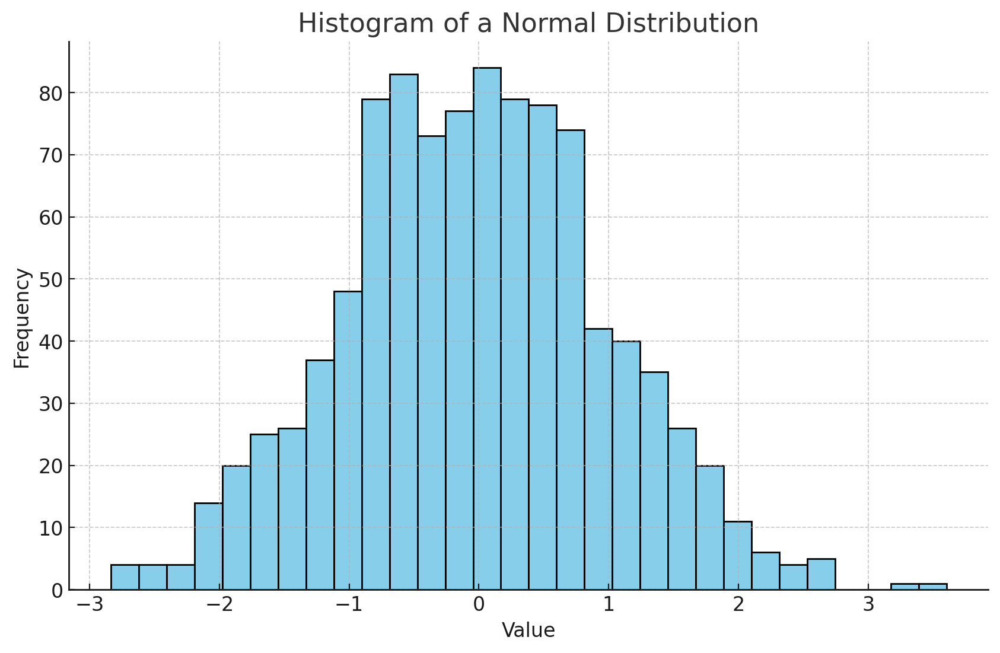
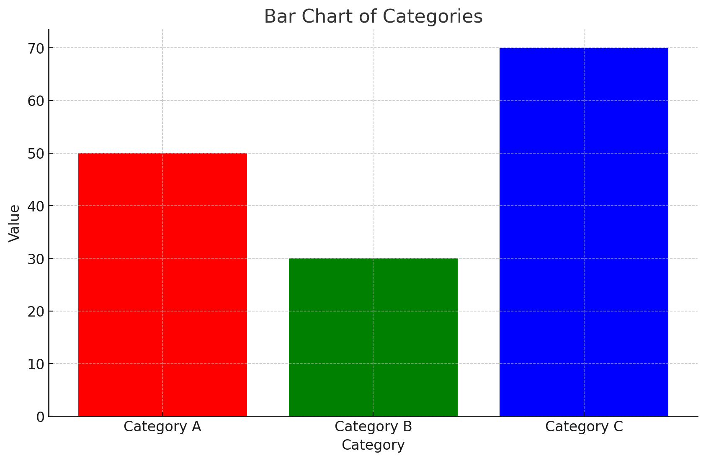
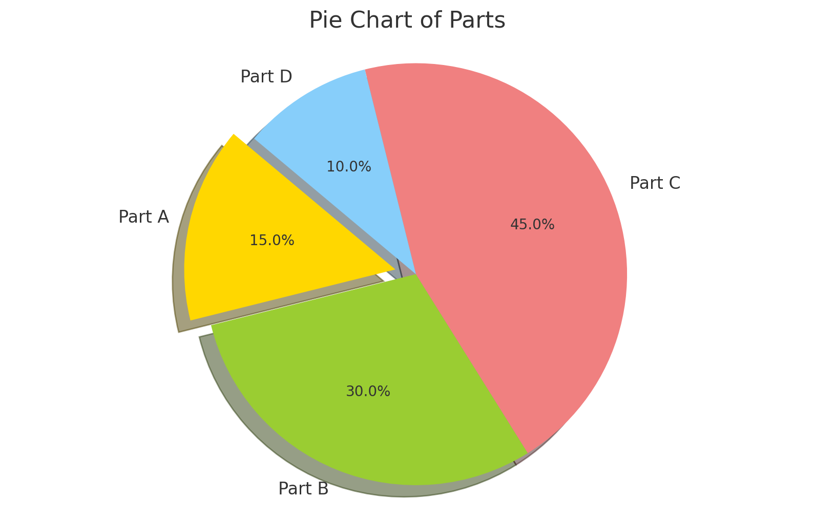
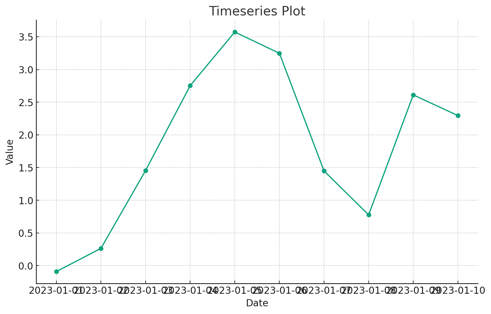
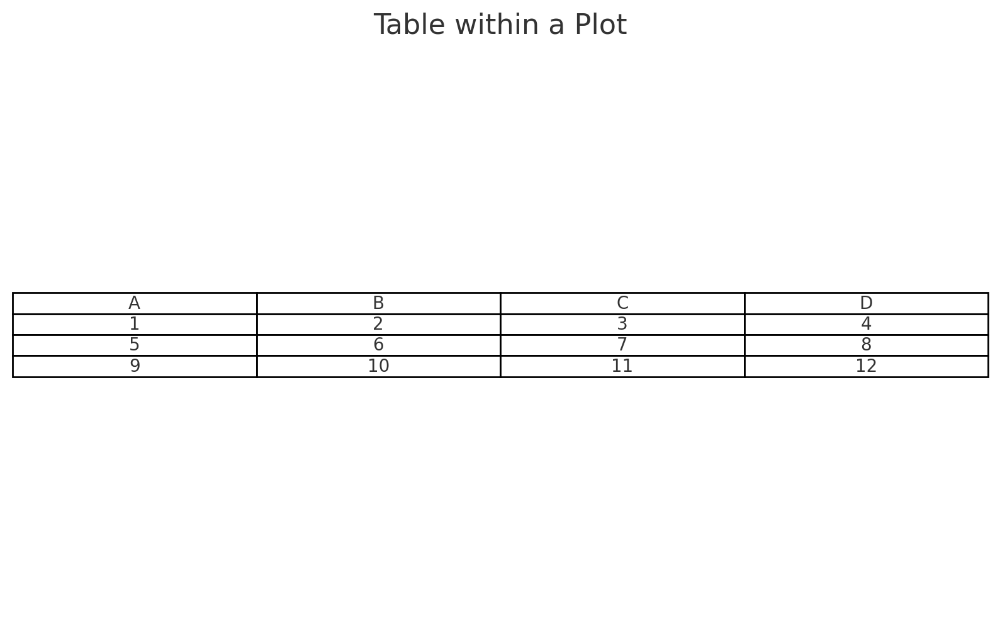
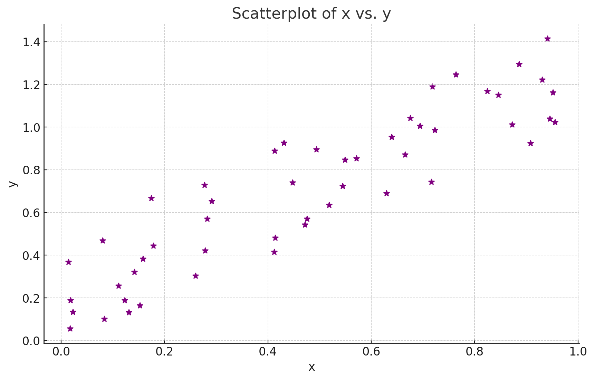

# Matplotlib: Chart Types

## **Histograms**

### **Understanding Distributions with Histograms**

Histograms are powerful tools for visualizing the distribution of data. They partition data into bins and then display the count of data points within each bin.

```python
# Sample data: 1000 data points from a normal distribution
import numpy as np
data = np.random.randn(1000)

plt.hist(data, bins=30, color='skyblue', edgecolor='black')
plt.title("Histogram of a Normal Distribution")
plt.xlabel("Value")
plt.ylabel("Frequency")

plt.show()
```

Let's visualize this histogram:



Histograms, like the one displayed above, are instrumental in understanding how data is distributed. This is especially helpful in machine learning when checking for data normality or understanding the spread of features.

* * *

## **Bar Charts**

### **Comparing Categories with Bar Charts**

Bar charts are excellent for comparing quantities across different categories.

```python
categories = ['Category A', 'Category B', 'Category C']
values = [50, 30, 70]

plt.bar(categories, values, color=['red', 'green', 'blue'])
plt.title("Bar Chart of Categories")
plt.xlabel("Category")
plt.ylabel("Value")

plt.show()
```

Let's take a look at this bar chart:



Bar charts, like the one above, provide a clear visual comparison between categories, making it easy to discern relative sizes at a glance.

* * *

## **Pie Charts**

### **Visualizing Proportions with Pie Charts**

Pie charts are ideal for displaying the proportional breakdown of categories within a whole.

```python
labels = ['Part A', 'Part B', 'Part C', 'Part D']
sizes = [15, 30, 45, 10]
colors = ['gold', 'yellowgreen', 'lightcoral', 'lightskyblue']
explode = (0.1, 0, 0, 0)  # explode 1st slice

plt.pie(sizes, explode=explode, labels=labels, colors=colors, autopct='%1.1f%%', shadow=True, startangle=140)
plt.axis('equal')  # Equal aspect ratio ensures that pie is drawn as a circle.
plt.title("Pie Chart of Parts")

plt.show()
```

Let's visualize this pie chart:



Pie charts, like the one above, offer an intuitive representation of parts-to-whole relationships, helping to understand the significance of each category within a total sum.

* * *

## **Timeseries**

### **Tracking Changes Over Time with Timeseries**

Timeseries plots are crucial for visualizing data points at successive intervals of time.

```python
# Sample data
dates = pd.date_range("20230101", periods=10)
values = np.cumsum(np.random.randn(10))

plt.plot(dates, values, marker='o', linestyle='-')
plt.title("Timeseries Plot")
plt.xlabel("Date")
plt.ylabel("Value")

plt.show()
```

Let's visualize this timeseries plot:



Timeseries plots, like the one shown, are pivotal for understanding trends, patterns, and anomalies in temporal data, making them indispensable in domains like finance, economics, and weather forecasting.

* * *

## **Tables**

### **Displaying Tabular Data within Plots**

Sometimes, it's useful to display data in tabular form alongside plots for detailed insights.

```python
# Sample data
columns = ['A', 'B', 'C', 'D']
cell_text = [[1, 2, 3, 4], [5, 6, 7, 8], [9, 10, 11, 12]]

fig, ax = plt.subplots()
ax.axis('tight')
ax.axis('off')
ax.table(cellText=cell_text, colLabels=columns, cellLoc='center', loc='center')

plt.title("Table within a Plot")

plt.show()
```

Let's visualize this table:



As depicted, tables within plots offer a dual advantage: they provide detailed data points while retaining the context of the visualization, making them especially useful for reports and presentations.

* * *

## **Scatterplots**

### **Visualizing Relationships with Scatterplots**

Scatterplots are essential to understand the relationship or correlation between two variables.

```python
# Sample data
x = np.random.rand(50)
y = x + np.random.rand(50) * 0.5

plt.scatter(x, y, color='purple', marker='*')
plt.title("Scatterplot of x vs. y")
plt.xlabel("x")
plt.ylabel("y")

plt.show()
```

Let's visualize this scatterplot:



Scatterplots, like the one presented, are instrumental in unveiling relationships between variables. By observing the distribution and pattern of points, one can infer correlations, clusters, and potential outliers.

* * *

## **Conclusion**

Matplotlib's extensive array of chart types ensures that you're never left wanting when it comes to visualizing your data. Whether it's understanding distributions with histograms, comparing categories with bar charts, or tracking changes over time with timeseries plots, Matplotlib has you covered. With this tutorial's insights, you're now equipped to choose the right chart type for your specific needs and communicate your machine learning findings effectively. Dive deep, explore, and let your data narratives shine through your visualizations!

---

!!! note "Version 1.0"

    This is currently an early version of the learning material and it will be updated over time with more detailed information.

    A video will be provided with the learning material as well.

    Be sure to subscribe to stay up-to-date with the latest updates.

<div style="padding: 20px; color: white; background-color: #0f1624; border-radius: 10px; margin: 10px 0 20px 0; text-align: center;">
    <h2 style="color: white;">Need help mastering Machine Learning?</h2>
    <p style="font-size: 16px;">Don't just follow along — join me!
    Get exclusive access to me, your instructor, who can help answer any of your questions. Additionally, get access to a private learning group where you can learn together and support each other on your AI journey.
    </p><br>
    <div style="text-align: center; margin-bottom: 20px;">
        <button style="display: inline-block; padding: 10px 20px; font-size: 20px; color: white; background: #1018A8; border: none; border-radius: 5px;">
            <a href="/subscribe" style="color: white; text-decoration: none;">Subscribe Now</a>
        </button>
    </div>
</div>