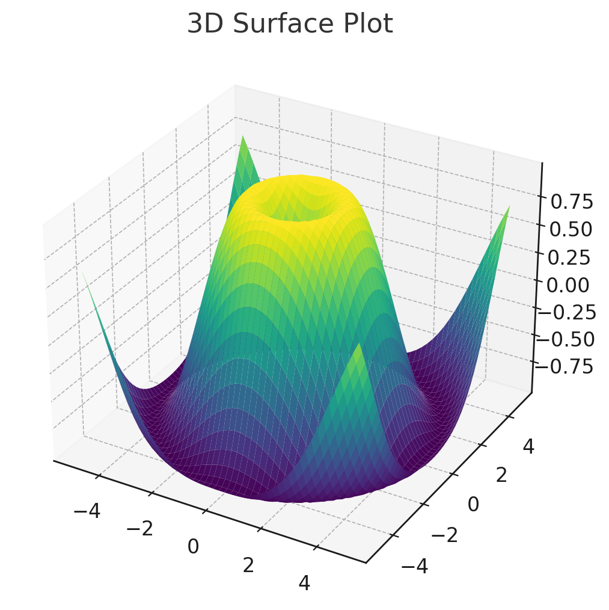
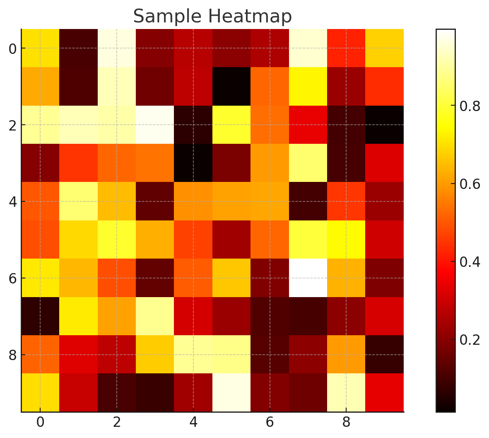

# Matplotlib: Specialized Visualization

## **3D Surfaces**

### **Diving into the Third Dimension**

3D surface plots are fantastic for visualizing functions of two variables. They add depth to your visualizations, literally and figuratively!

To create 3D plots, you'll need to use the `Axes3D` module from Matplotlib.

```python
from mpl_toolkits.mplot3d import Axes3D

# Sample data
X = np.linspace(-5, 5, 50)
Y = np.linspace(-5, 5, 50)
X, Y = np.meshgrid(X, Y)
Z = np.sin(np.sqrt(X**2 + Y**2))

fig = plt.figure()
ax = fig.add_subplot(111, projection='3d')
ax.plot_surface(X, Y, Z, cmap='viridis')

plt.title("3D Surface Plot")

plt.show()
```

Let's visualize this 3D surface:



There we have it! The 3D surface plot above provides a captivating representation of our function in three dimensions. It's particularly useful when you need to understand the behavior of a function across two variables simultaneously.

* * *

## **Heatmaps**

### **Visualizing Data Density and Magnitude**

Heatmaps are fantastic for understanding data density, magnitude, and correlations. They represent data values using a gradient of colors.

```python
# Sample data: a 10x10 matrix with random values
matrix_data = np.random.rand(10, 10)

plt.imshow(matrix_data, cmap='hot', interpolation='nearest')
plt.colorbar()
plt.title("Sample Heatmap")

plt.show()
```

Let's visualize this heatmap:



Heatmaps, like the one shown above, offer a vibrant representation of data magnitudes, making them highly effective for understanding the concentration and distribution of values across a matrix or grid.

* * *

## **Conclusion**

Specialized visualizations in Matplotlib open up a world of opportunities for data scientists and machine learning engineers. Whether it's diving into the third dimension with 3D surface plots, uncovering financial insights with candlestick charts, or understanding data densities with heatmaps, Matplotlib ensures that you're equipped with the right visualization for every scenario. With the insights from this tutorial, you're now ready to tackle even the most complex datasets, translating raw data into captivating visual narratives. Dive in, and let the visualizations do the talking!

---

!!! note "Version 1.0"

    This is currently an early version of the learning material and it will be updated over time with more detailed information.

    A video will be provided with the learning material as well.

    Be sure to subscribe to stay up-to-date with the latest updates.

<div style="padding: 20px; color: white; background-color: #0f1624; border-radius: 10px; margin: 10px 0 20px 0; text-align: center;">
    <h2 style="color: white;">Need help mastering Machine Learning?</h2>
    <p style="font-size: 16px;">Don't just follow along — join me!
    Get exclusive access to me, your instructor, who can help answer any of your questions. Additionally, get access to a private learning group where you can learn together and support each other on your AI journey.
    </p><br>
    <div style="text-align: center; margin-bottom: 20px;">
        <button style="display: inline-block; padding: 10px 20px; font-size: 20px; color: white; background: #1018A8; border: none; border-radius: 5px;">
            <a href="/subscribe" style="color: white; text-decoration: none;">Subscribe Now</a>
        </button>
    </div>
</div>