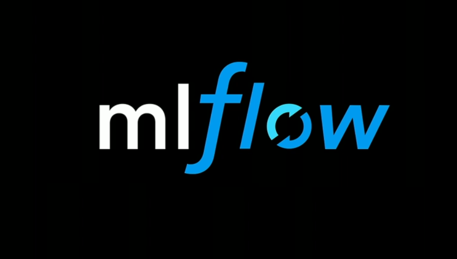

# MLflow



## **The Growing Importance of MLflow in the Machine Learning Ecosystem**

The field of machine learning is replete with challenges beyond just model training. Managing the entire lifecycle of a machine learning project—from experimentation to deployment—can be a herculean task. This is where MLflow steps in, offering an open-source platform that streamlines the machine learning lifecycle.

### **What is MLflow?**

Founded by Databricks, MLflow is an open-source platform designed to manage the end-to-end machine learning lifecycle. It encompasses tools for tracking experiments, packaging code into reproducible runs, and sharing and deploying models.

### **Why Choose MLflow for Machine Learning?**

With a myriad of tools and frameworks in the machine learning space, ensuring seamless integration and management can be daunting. MLflow provides a unified interface to integrate these tools, making the ML lifecycle smoother and more manageable.

## **Diving Deep into MLflow’s Capabilities**

### **Experiment Tracking**

One of the fundamental aspects of machine learning is experimentation. With various models, parameters, and metrics, keeping track can quickly become overwhelming. MLflow's tracking component lets you log and query experiments, making it easy to compare and contrast different runs.

### **Project Packaging**

Reproducibility is a cornerstone in the world of machine learning. MLflow projects offer a standardized format to package reusable and reproducible ML code. This includes environment specifications and a way to run the code, ensuring consistency across various stages and platforms.

### **Model Management**

Once models are trained, managing them—versioning, annotating, and transitioning through stages like staging or production—becomes crucial. MLflow’s model registry component provides a centralized repository to collaboratively manage the full lifecycle of an MLflow Model.

### **Model Deployment**

Taking a machine learning model from experimentation to production is no small feat. MLflow offers tools to deploy machine learning models in multiple formats and to various platforms, be it a local machine or cloud services.

## **Getting Started with MLflow**

### **Installation and Setup**

Installing MLflow is a breeze with pip:

```bash
pip install mlflow
```

With MLflow installed, you can initiate an MLflow tracking server, log parameters, metrics, and models, and view your results in the MLflow UI.

### **A Simple MLflow Workflow**

At its core, using MLflow involves logging key details during model training. Here's a basic example:

```python
import mlflow

# Start an MLflow run
with mlflow.start_run():
    # Log parameters
    mlflow.log_param("param1", param_value1)
    
    # Train your model...

    # Log metrics
    mlflow.log_metric("accuracy", accuracy_value)
    
    # Save model
    mlflow.pyfunc.save_model(path="models/model", 
                             python_model=my_model)
```

With this simple structure, you've already captured essential details about your ML experiment.

## **Best Practices with MLflow in Machine Learning**

### **Structured Logging**

While MLflow is flexible in terms of what you can log, adhering to a structured logging practice ensures clarity. Log model hyperparameters, key metrics, and any additional metadata that provides context about the run.

### **Centralized Tracking Server**

In collaborative environments, it's beneficial to set up a centralized MLflow tracking server. This allows teams to collectively track and compare experiments, fostering collaboration and knowledge sharing.

### **Integrate with Source Control**

Ensure that your ML codebase is integrated with a version control system like Git. MLflow can automatically capture Git commit hash, ensuring even greater reproducibility.

## **Conclusion**

MLflow has rapidly emerged as an indispensable tool in the machine learning toolkit. It addresses critical pain points in the ML lifecycle, from tracking experiments to deploying models. For professionals venturing into the intricate world of machine learning, adopting MLflow can lead to streamlined workflows, enhanced collaboration, and, ultimately, more successful ML projects. Embrace MLflow and witness a transformative shift in how you manage and deploy your machine learning endeavors.

---

!!! note "Version 1.0"

    This is currently an early version of the learning material and it will be updated over time with more detailed information.

    A video will be provided with the learning material as well.

    Be sure to subscribe to stay up-to-date with the latest updates.

<div style="padding: 20px; color: white; background-color: #0f1624; border-radius: 10px; margin: 10px 0 20px 0; text-align: center;">
    <h2 style="color: white;">Need help mastering Machine Learning?</h2>
    <p style="font-size: 16px;">Don't just follow along — join me!
    Get exclusive access to me, your instructor, who can help answer any of your questions. Additionally, get access to a private learning group where you can learn together and support each other on your AI journey.
    </p><br>
    <div style="text-align: center; margin-bottom: 20px;">
        <button style="display: inline-block; padding: 10px 20px; font-size: 20px; color: white; background: #1018A8; border: none; border-radius: 5px;">
            <a href="/subscribe" style="color: white; text-decoration: none;">Subscribe Now</a>
        </button>
    </div>
</div>