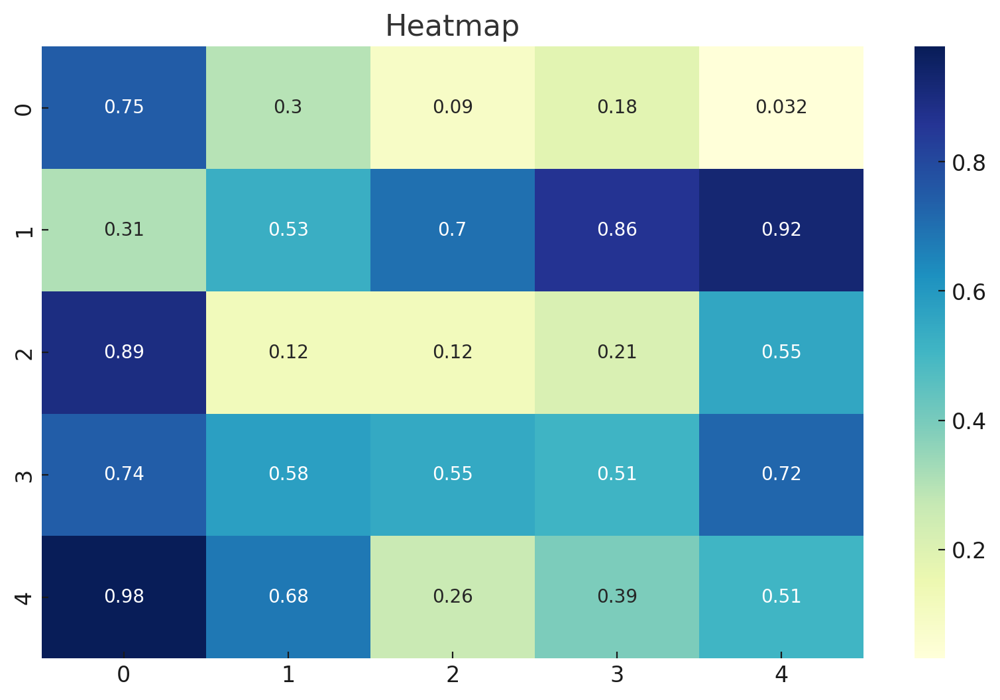
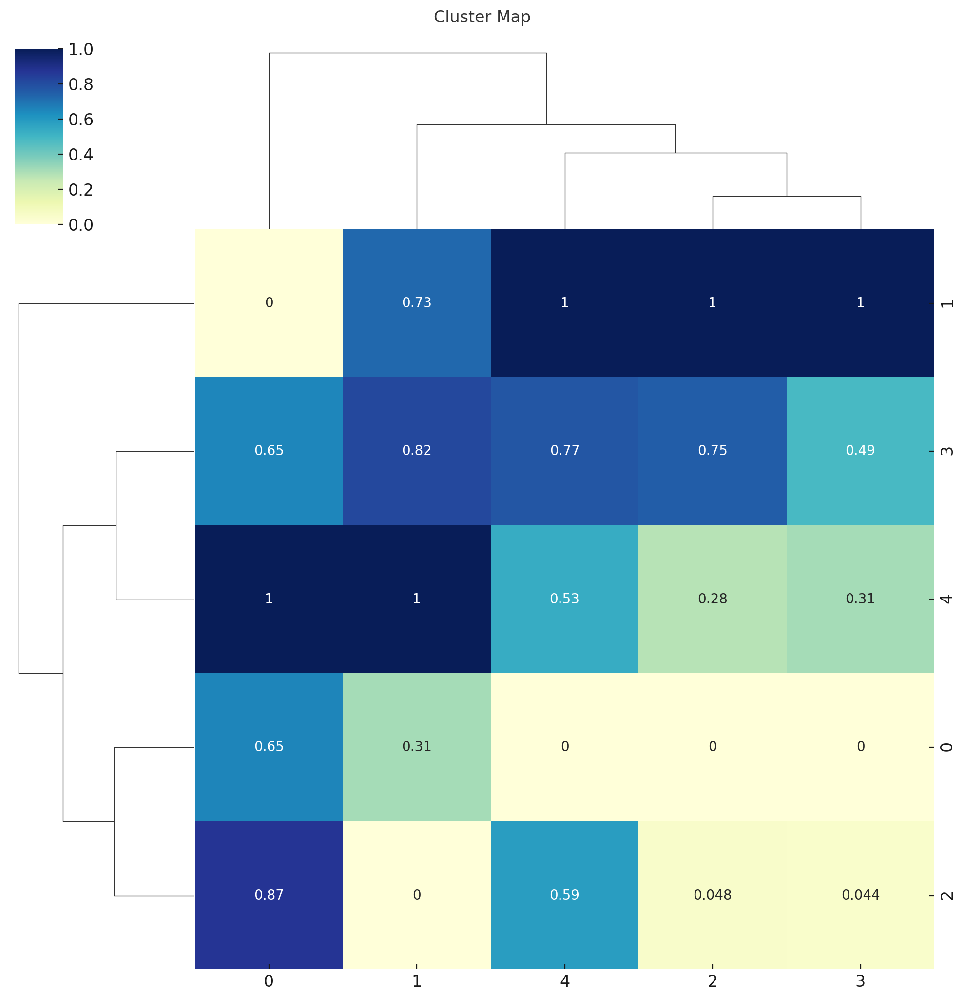
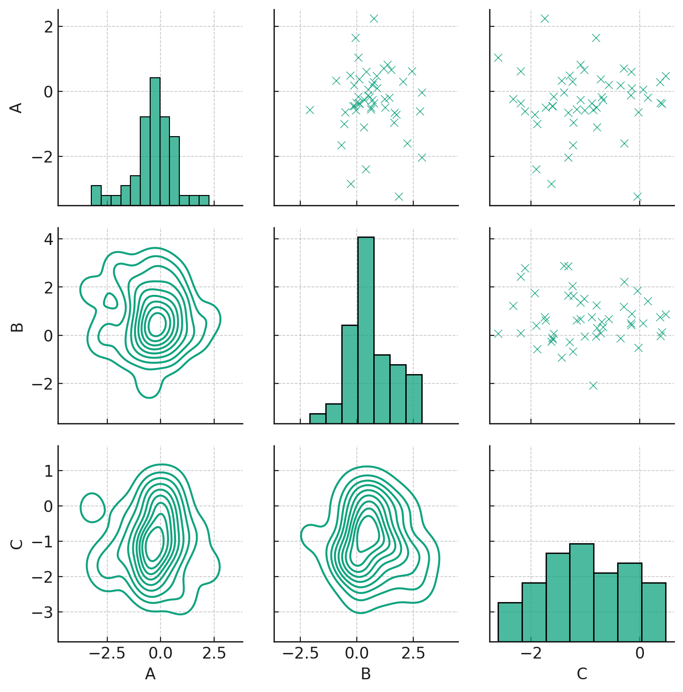
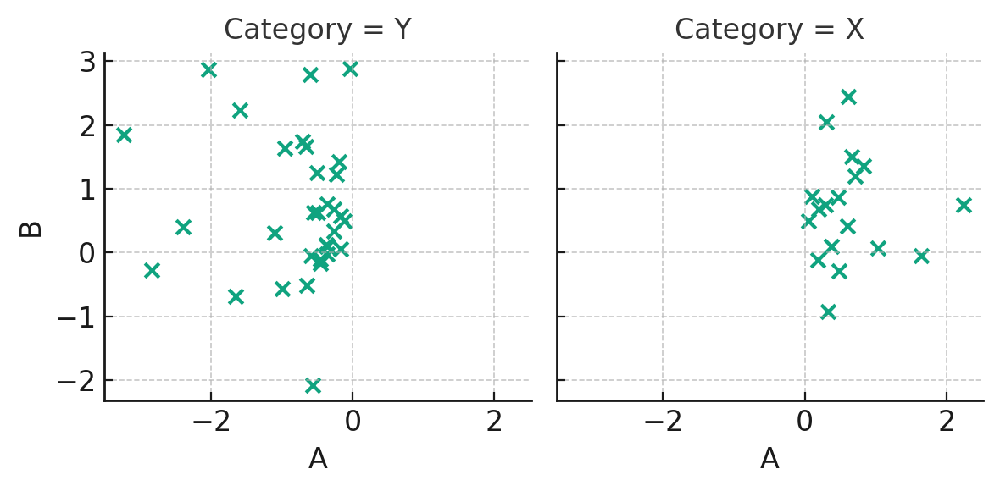

# Seaborn: Advanced Visualizations

## **Mastering Sophisticated Visualizations with Seaborn**

In the multifaceted realm of data science and machine learning, sometimes basic plots just don't cut it. To unravel deeper insights, showcase intricate relationships, or simply create compelling data stories, advanced visualizations come into play. Seaborn, a premier Python data visualization library, offers a slew of advanced plotting mechanisms tailor-made for such intricate requirements. This tutorial is your gateway to mastering these advanced visualizations, ensuring your data narratives are both insightful and captivating.

* * *

## **Heatmaps**

### **Visualizing Matrix-like Data**

Heatmaps are powerful tools for visualizing matrix-like data. Through a gradient of colors, they provide a visual representation of the magnitude of entries, making patterns in data discernible.

For demonstration, let's consider a matrix of random values:

```python
import seaborn as sns
import matplotlib.pyplot as plt
import numpy as np

# Sample data: A 5x5 matrix of random values
matrix_data = np.random.rand(5, 5)

sns.heatmap(matrix_data, annot=True)
plt.title("Heatmap")

plt.show()
```

Let's visualize this heatmap:



Here's the **Heatmap**. This visualization uses colors to represent the magnitude of matrix values. The color intensity reflects the value's magnitude, making it easy to identify patterns or anomalies. The `annot=True` parameter ensures that the actual values are displayed on the heatmap, offering precise context.

* * *

## **Cluster Map**

### **Grouping Similar Rows and Columns**

A cluster map is an advanced heatmap that also arranges rows and columns based on similarity, using hierarchical clustering.

```python
sns.clustermap(matrix_data, annot=True, cmap="YlGnBu", standard_scale=1)
plt.title("Cluster Map")

plt.show()
```

Let's visualize this cluster map:



Presented above is the **Cluster Map**. It goes a step beyond traditional heatmaps by not only visualizing data but also clustering rows and columns based on their similarity. Notice how the rows and columns might be in a different order compared to the heatmap, as the cluster map rearranges them to group similar rows and columns together. This reorganization is facilitated by hierarchical clustering, making it easier to discern patterns and relationships in the data.

* * *

## **Pair Grid**

### **A Customizable Grid of Subplots**

While `pairplot` gives a quick look into relationships between multiple variables, `PairGrid` offers more customization, allowing you to decide what kind of plot goes in each section of the grid.

Let's consider a sample dataframe:

```python
import pandas as pd

# Sample dataframe
df = pd.DataFrame({
    'A': np.random.randn(50),
    'B': np.random.randn(50) + 1,
    'C': np.random.randn(50) - 1
})

g = sns.PairGrid(df)
g.map_upper(sns.scatterplot)
g.map_lower(sns.kdeplot)
g.map_diag(sns.histplot)

plt.show()
```

Let's visualize this pair grid:



Here's the **PairGrid** visualization. As demonstrated:

* The diagonal section displays histograms of individual variables using `sns.histplot`.
* The upper section of the grid showcases scatter plots between pairs of variables using `sns.scatterplot`.
* The lower section visualizes the KDE (Kernel Density Estimation) of bivariate distributions using `sns.kdeplot`.

The flexibility of PairGrid lies in its ability to let you decide which type of plot to use in each section, allowing for a detailed, yet customizable, exploration of relationships between variables.

* * *

## **Facet Grid**

### **Faceted Visualization with a Grid**

`FacetGrid` is an advanced plot type in Seaborn that allows you to visualize multiple plots on a grid, based on the values of one or more categorical variables. It's immensely useful for understanding interactions between variables across different categories.

For illustration, let's consider a dataset with a categorical variable and two continuous variables:

```python
# Sample data
df['Category'] = ['X' if val > 0 else 'Y' for val in df['A']]

g = sns.FacetGrid(df, col="Category")
g.map(plt.scatter, "A", "B")

plt.show()
```

Let's visualize this facet grid:



The **FacetGrid** displayed above offers a way to visualize data across different categories—in this case, categories "X" and "Y". Each subplot corresponds to a category from the `Category` column. Within each subplot, we have a scatter plot showcasing the relationship between variables 'A' and 'B'.

FacetGrids are immensely useful when you want to explore the impact of a categorical variable on other variables' relationships. By placing these relationships side by side, it becomes easier to discern patterns and differences across categories.

* * *

## **Conclusion**

Advanced visualization techniques in Seaborn elevate your data stories. Whether you're deciphering intricate relationships with PairGrid, exploring data distributions with heatmaps, or understanding categorical influences with FacetGrid, Seaborn's advanced plotting mechanisms ensure clarity and insight. With the knowledge from this tutorial, you're equipped to delve deeper into your datasets, uncovering stories and patterns that basic plots might miss. Dive into the world of advanced data visualization with Seaborn and let the intricate tales of your data come to life!

---

!!! note "Version 1.0"

    This is currently an early version of the learning material and it will be updated over time with more detailed information.

    A video will be provided with the learning material as well.

    Be sure to subscribe to stay up-to-date with the latest updates.

<div style="padding: 20px; color: white; background-color: #0f1624; border-radius: 10px; margin: 10px 0 20px 0; text-align: center;">
    <h2 style="color: white;">Need help mastering Machine Learning?</h2>
    <p style="font-size: 16px;">Don't just follow along — join me!
    Get exclusive access to me, your instructor, who can help answer any of your questions. Additionally, get access to a private learning group where you can learn together and support each other on your AI journey.
    </p><br>
    <div style="text-align: center; margin-bottom: 20px;">
        <button style="display: inline-block; padding: 10px 20px; font-size: 20px; color: white; background: #1018A8; border: none; border-radius: 5px;">
            <a href="/subscribe" style="color: white; text-decoration: none;">Subscribe Now</a>
        </button>
    </div>
</div>