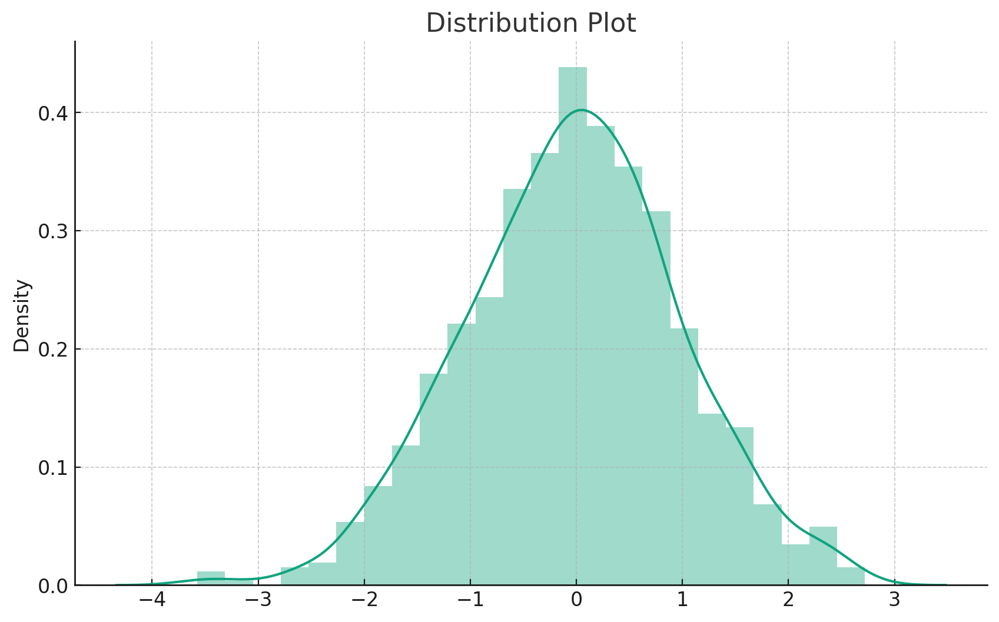
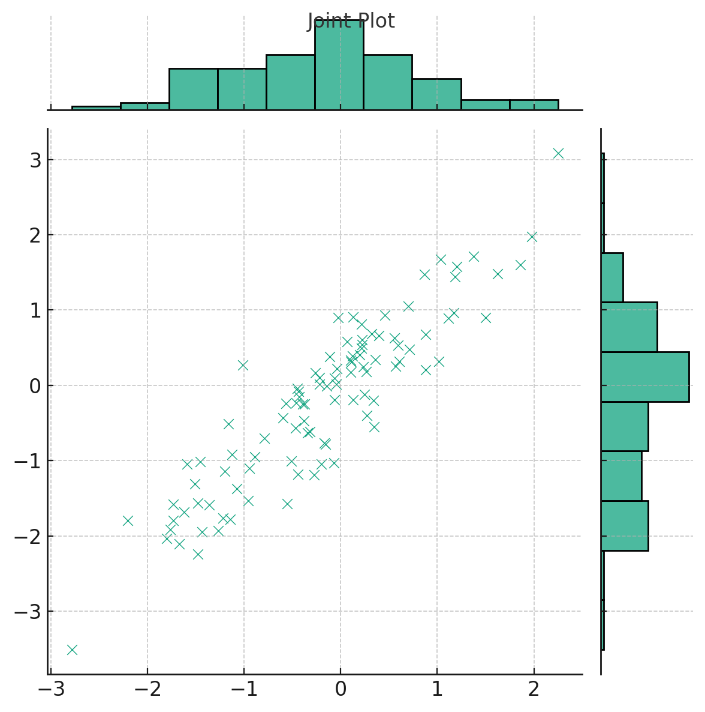
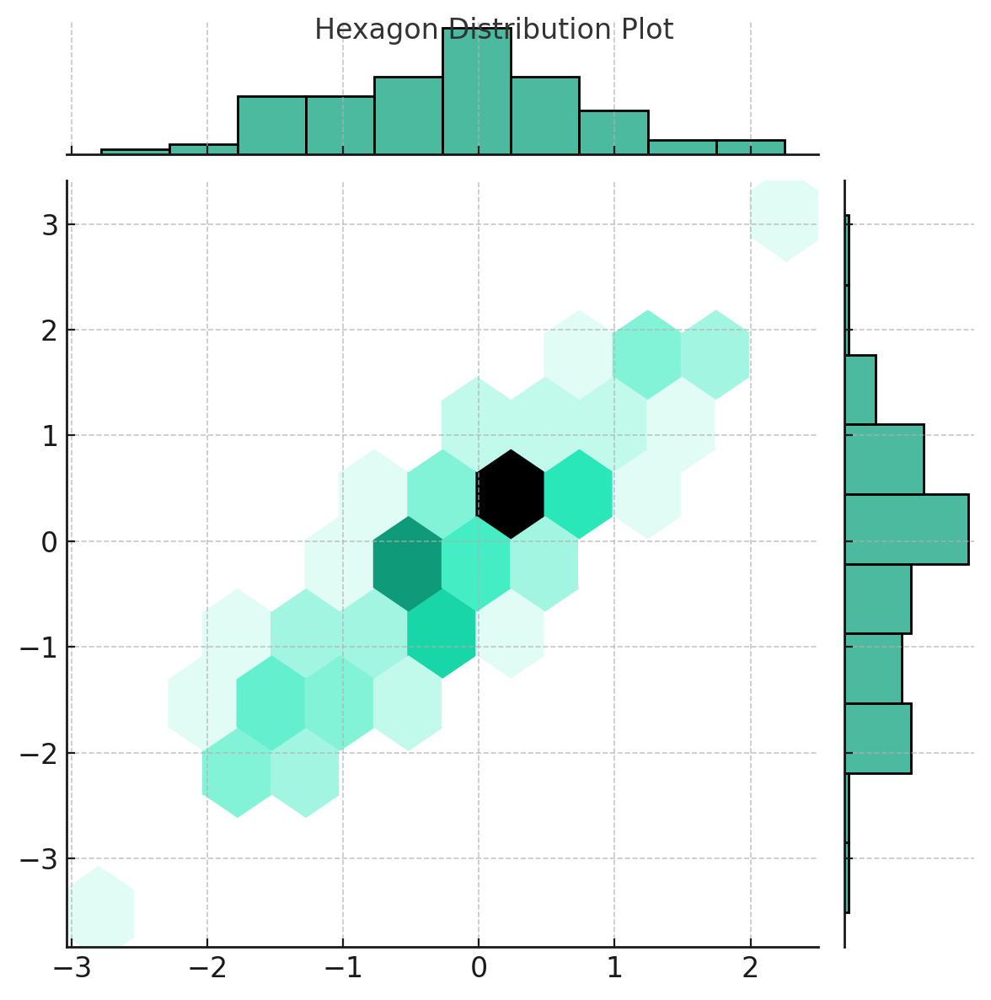
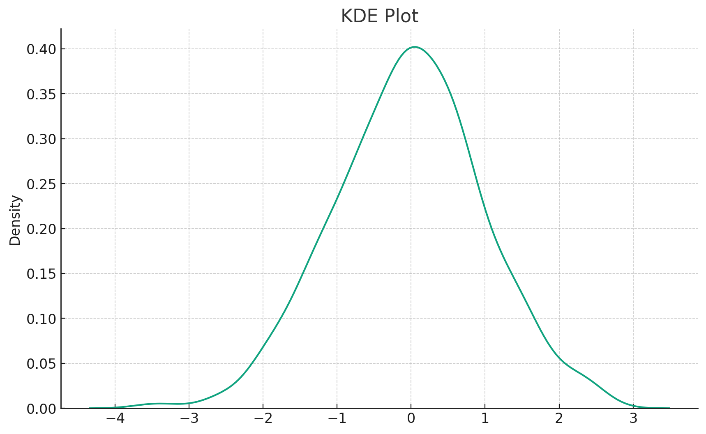
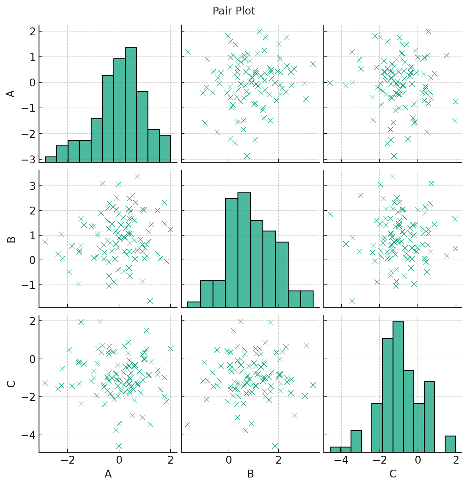
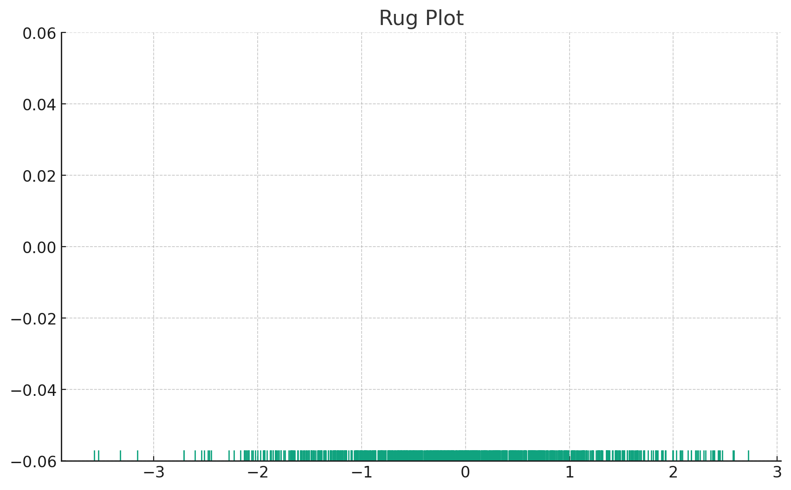

# Seaborn: Basic Plots

## **Distribution Plots in Seaborn**

Data distribution is a foundational aspect of understanding datasets in machine learning. It provides insights into the shape, variability, and central tendencies of your data. Seaborn, a powerful Python data visualization library built on Matplotlib, offers a suite of plots to examine distributions from various angles. This tutorial will guide you through the elegance and utility of Seaborn's basic distribution plots, ensuring you have the tools to delve deep into your dataset's characteristics.

### **Dive into Single Variable Distribution**

The distribution plot, often referred to as `distplot`, provides a way to observe the univariate distribution of observations.

```python
import seaborn as sns
import matplotlib.pyplot as plt

# Sample data: 1000 data points from a normal distribution
data = np.random.randn(1000)

sns.distplot(data)
plt.title("Distribution Plot")

plt.show()
```

Let's visualize this distribution:



Here's our distribution plot. It provides a histogram combined with a Kernel Density Estimation (KDE) to give a comprehensive view of the data's distribution. The histogram offers a discrete representation, while the KDE provides a smooth curve to estimate the data's probability density function.

* * *

## **Joint Plot**

### **Exploring Bivariate Distributions**

The `jointplot` displays a relationship between two variables, combining scatter plots, regression lines, and distribution plots.

```python
# Sample data
x = np.random.randn(100)
y = x + np.random.randn(100) * 0.5

sns.jointplot(x, y, kind='scatter')
plt.suptitle("Joint Plot")

plt.show()
```

Let's visualize this joint plot:



Here's the joint plot, which offers a dual representation:

* The scatter plot in the center displays the relationship between two variables, xxx and yyy.
* The histograms on the top and right margins show the univariate distribution of each variable.

Joint plots provide a comprehensive view of bivariate relationships, making them invaluable for initial exploratory data analysis.

* * *

## **Hexagon Distribution**

### **Dense Scatter Plots? No Problem!**

Hexagon bin plots can be thought of as a 2D histogram. Instead of points, the bivariate distributions are represented as hexagons, and the color denotes the number of points in that hexagon.

```python
sns.jointplot(x, y, kind='hex')
plt.suptitle("Hexagon Distribution Plot")

plt.show()
```

Let's visualize this hexagon distribution plot:



Here's the hexagon distribution plot. This kind of visualization is particularly useful when dealing with large datasets where scatter plots can become cluttered. Each hexagon represents a bin, and its color intensity indicates the number of points it contains, providing an intuitive sense of data density.

* * *

## **KDE Plot**

### **Unveiling Density Distributions**

Kernel Density Estimation (KDE) plots offer a smoothed version of the histogram, providing insights into the probability density of the data.

```python
sns.kdeplot(data)
plt.title("KDE Plot")

plt.show()
```

Let's visualize this KDE plot:



The KDE plot, as displayed above, offers a smooth curve representing the probability density of the dataset. Unlike histograms that rely on bins, KDE plots utilize kernel functions to provide a continuous estimate, making them an invaluable tool for understanding the shape of data distributions.

* * *

## **Pair Plot**

### **A Matrix of Visualizations**

The `pairplot` function plots pairwise relationships across an entire dataframe. It's particularly handy for initial exploratory data analysis to understand relationships between multiple variables.

For demonstration, let's consider a sample dataset with three features:

```python
# Sample dataframe with three features
df = pd.DataFrame({
    'A': np.random.randn(100),
    'B': np.random.randn(100) + 1,
    'C': np.random.randn(100) - 1
})

sns.pairplot(df)
plt.suptitle("Pair Plot", y=1.02)

plt.show()
```

Let's visualize this pair plot:



Presented above is the pair plot. This visualization showcases relationships between all pairs of features in our sample dataframe:

* Diagonal plots represent the distribution of a single variable, usually as histograms.
* Off-diagonal plots display scatter plots between two different variables.

Pair plots are an excellent starting point in exploratory data analysis, particularly when trying to understand relationships and distributions among multiple variables simultaneously.

* * *

## **Rug Plot**

### **Highlighting Individual Data Points**

A rug plot is a very simple, yet effective, tool for displaying individual data points along an axis. It's like a flattened-out histogram, where each tick represents a data point.

```python
sns.rugplot(data)
plt.title("Rug Plot")

plt.show()
```

Let's visualize this rug plot:



Above is the rug plot. As you can observe, it places a small vertical tick for every data point in our sample. This plot provides an intuitive sense of the distribution of data points along the axis, making it especially valuable when you want to emphasize individual data point locations.

* * *

## **Conclusion**

Understanding data distributions is paramount in machine learning. With Seaborn's suite of distribution plots, you're well-equipped to dive into your data, unravel its intricacies, and derive valuable insights. Whether you're exploring the density of data with KDE plots, investigating bivariate relationships with joint plots, or emphasizing individual data points with rug plots, Seaborn ensures you're never left wanting for visualization options. With the insights from this tutorial, you're poised to embark on a fulfilling journey of data exploration and storytelling. Dive deep, and let your data's story unfold before your eyes!

---

!!! note "Version 1.0"

    This is currently an early version of the learning material and it will be updated over time with more detailed information.

    A video will be provided with the learning material as well.

    Be sure to subscribe to stay up-to-date with the latest updates.

<div style="padding: 20px; color: white; background-color: #0f1624; border-radius: 10px; margin: 10px 0 20px 0; text-align: center;">
    <h2 style="color: white;">Need help mastering Machine Learning?</h2>
    <p style="font-size: 16px;">Don't just follow along — join me!
    Get exclusive access to me, your instructor, who can help answer any of your questions. Additionally, get access to a private learning group where you can learn together and support each other on your AI journey.
    </p><br>
    <div style="text-align: center; margin-bottom: 20px;">
        <button style="display: inline-block; padding: 10px 20px; font-size: 20px; color: white; background: #1018A8; border: none; border-radius: 5px;">
            <a href="/subscribe" style="color: white; text-decoration: none;">Subscribe Now</a>
        </button>
    </div>
</div>