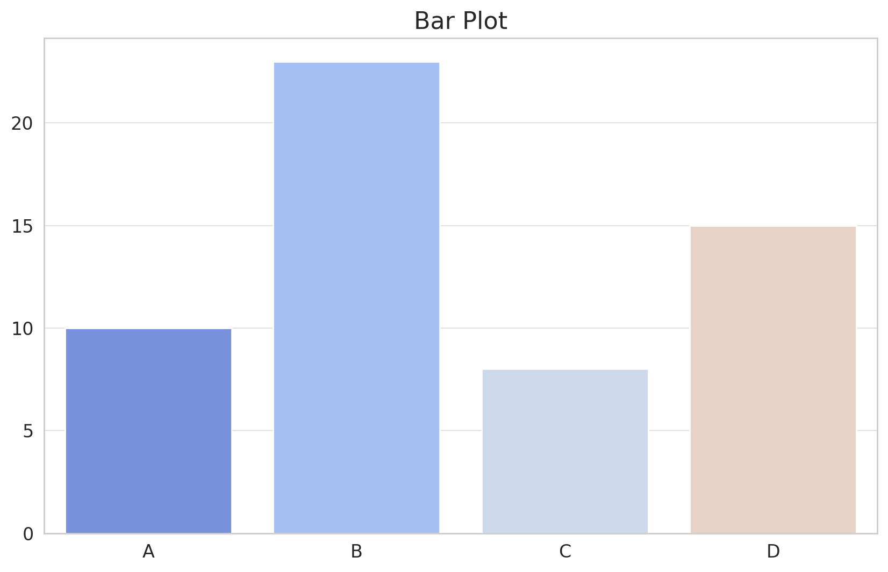
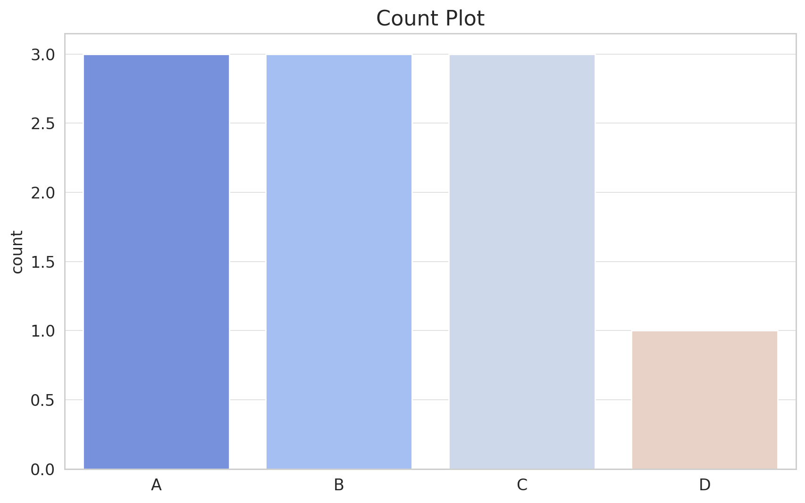
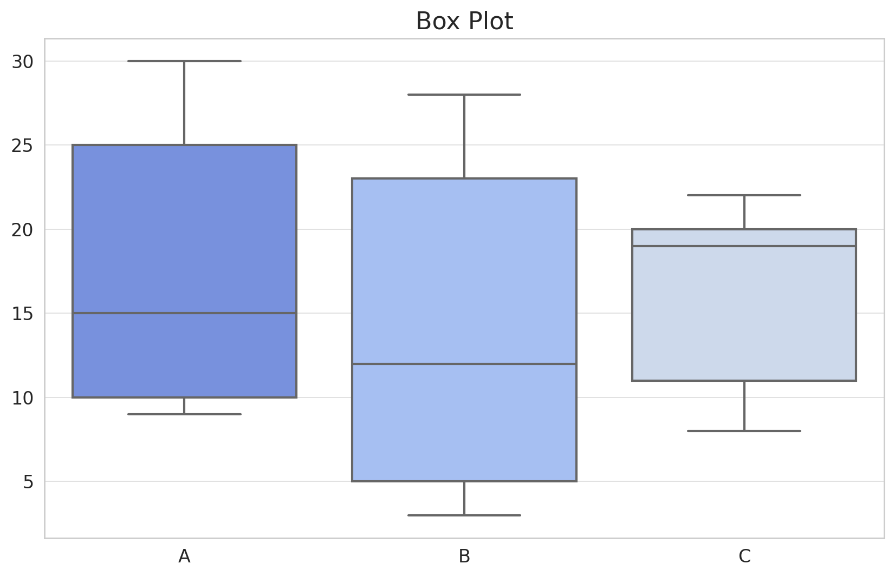
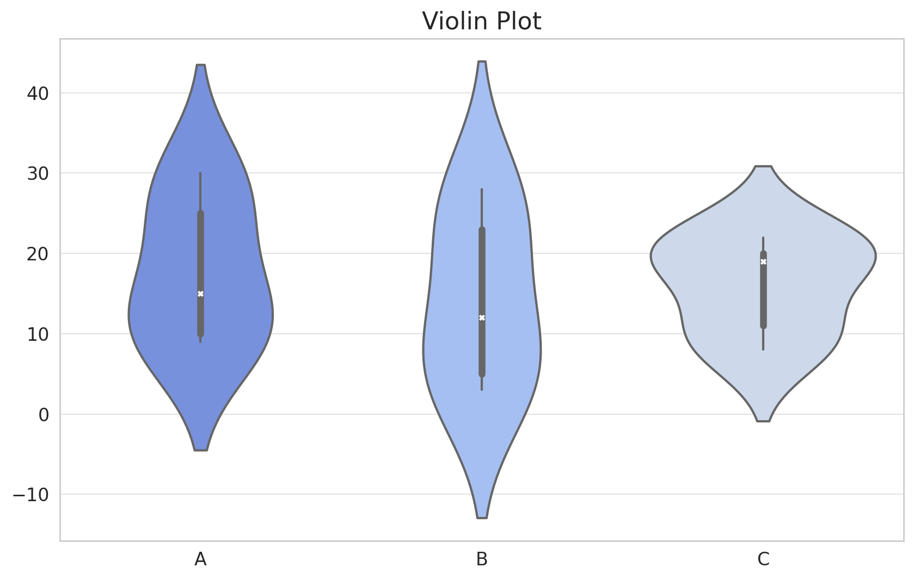
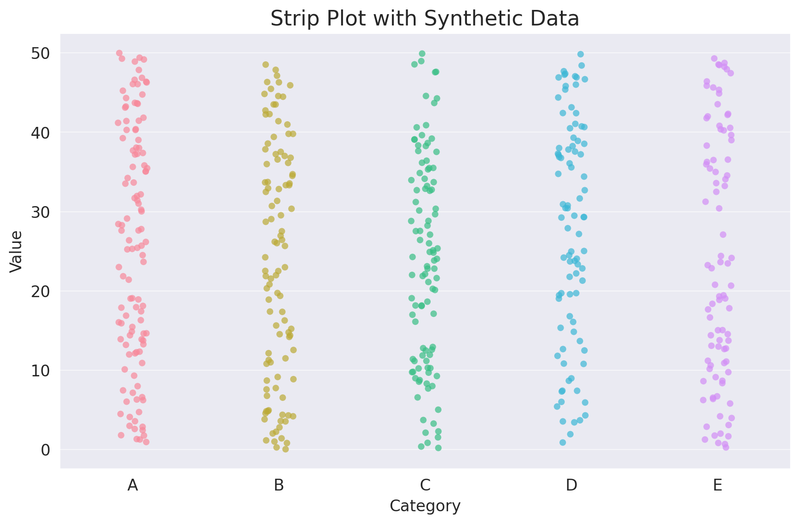
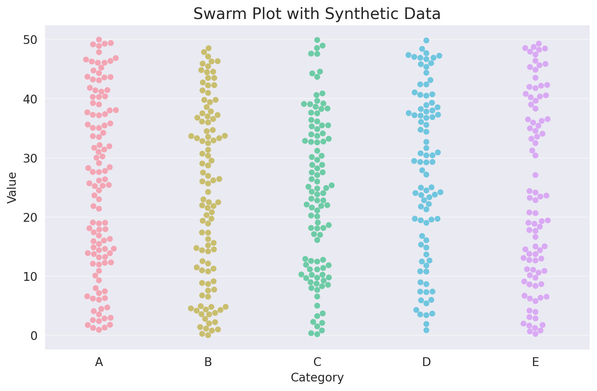

# Seaborn: Categorical Plots

## **Unlocking the Power of Categorical Data Visualization with Seaborn**

Categorical data forms a significant chunk of datasets in machine learning. Whether it's product categories, user demographics, or survey responses, understanding categorical data is vital. Seaborn, an advanced Python visualization library, simplifies this with its suite of categorical plots. This tutorial will guide you through the myriad of Seaborn's categorical plots, enabling you to effectively visualize and derive insights from your categorical data.

* * *

## **Bar Plot**

### **Diving into Category Values**

Bar plots are perhaps the most intuitive way to visualize categorical data. They represent the central tendency of a dataset with rectangular bars.

```python
import seaborn as sns
import matplotlib.pyplot as plt

# Sample data
categories = ['A', 'B', 'C', 'D']
values = [10, 23, 8, 15]

sns.barplot(x=categories, y=values)
plt.title("Bar Plot")

plt.show()
```

Let's visualize this bar plot:



The **Bar Plot** showcased above provides a visual representation of different categories and their respective values. Each category is denoted by a bar, and the height of the bar corresponds to its value. Bar plots are effective for comparing different categories, making them a staple in data visualization.

* * *

## **Count Plot**

### **Counting Occurrences in Categories**

The count plot is a special type of bar plot where the y-axis represents the count of occurrences of each category in the dataset.

```python
# Sample data
data = ['A', 'B', 'B', 'C', 'A', 'C', 'C', 'A', 'B', 'D']

sns.countplot(x=data)
plt.title("Count Plot")

plt.show()
```

Let's visualize this count plot:



The **Count Plot** displayed above offers a straightforward visualization of the occurrence count of each category. Similar to a bar plot, but instead of arbitrary values, it shows the number of occurrences, making it highly useful for understanding the distribution of categorical data.

* * *

## **Box Plot**

### **Peek into Data Spread and Outliers**

Box plots, also known as whisker plots, provide a glimpse into the spread of the data. They display the median, quartiles, and potential outliers of the dataset.

```python
# Sample data
data_values = [10, 23, 8, 15, 12, 22, 9, 3, 20, 25, 28, 11, 30, 5, 19]
data_categories = ['A', 'B', 'C', 'A', 'B', 'C', 'A', 'B', 'C', 'A', 'B', 'C', 'A', 'B', 'C']

sns.boxplot(x=data_categories, y=data_values)
plt.title("Box Plot")

plt.show()
```

Let's visualize this box plot:



The **Box Plot** presented above is a compact yet insightful visualization tool. It displays:

* The **box** itself which spans the Interquartile Range (IQR) from Q1 (the 25th percentile) to Q3 (the 75th percentile).
* The **median** (the 50th percentile) is represented by the line inside the box.
* **Whiskers** extend from the box to show the range of the data, and any data point beyond the whiskers is typically considered as outliers.

Box plots are invaluable for understanding data spread, variability, and potential anomalies.

* * *

## **Violin Plot**

### **Merging Box Plots and KDE**

The violin plot combines the merits of box plots and KDE, offering a deeper understanding of the data distribution.

```python
sns.violinplot(x=data_categories, y=data_values)
plt.title("Violin Plot")

plt.show()
```

Let's visualize this violin plot:



The **Violin Plot** displayed above is a versatile visualization tool:

* The **width** of the plot at different values indicates the density of the data, much like a KDE.
* Inside the violin, you can see a simplified box plot representation, showcasing the median and the interquartile range.

Violin plots are especially useful when you want to understand the distribution of data across categories, both in terms of summary statistics and overall distribution.

* * *

## **Strip Plot**

### **Visualizing Individual Data Points**

A strip plot is a scatter plot where one of the variables is categorical. It displays individual data points in a category.

```python
# Create the strip plot with enhanced marker settings
plt.figure(figsize=(10, 6))
sns.stripplot(x=category_assignments, y=values, order=categories, jitter=True, marker='o', alpha=0.7, size=5)
plt.title("Strip Plot with Synthetic Data")
plt.ylabel("Value")
plt.xlabel("Category")
plt.show()
```

Let's visualize this strip plot:



The **Strip Plot** shown above places individual data points along the categorical axis. Each dot represents a data point, allowing you to see the distribution of data points within each category. While it's similar to a scatter plot, the Strip Plot distinguishes itself by handling categorical data on one axis.

* * *

## **Swarm Plot**

### **Avoiding Overlaps for Clarity**

The swarm plot is like the strip plot but with a twist: data points are adjusted so they don't overlap, giving a better representation of the distribution.

```python
# Create the swarm plot with adjusted settings for better visibility
plt.figure(figsize=(10, 6))
sns.swarmplot(x=category_assignments, y=values, order=categories, marker='o', alpha=0.7, size=6)
plt.title("Swarm Plot with Synthetic Data")
plt.ylabel("Value")
plt.xlabel("Category")
plt.show()
```

Let's visualize this swarm plot:



The **Swarm Plot** depicted above is a categorical scatter plot with non-overlapping points. This ensures that the distribution of data points within each category is clearly visible, making it easier to observe the spread and density of data points in each category.

* * *

## **Conclusion**

Categorical data, with its distinct values and classes, brings unique challenges and opportunities to the realm of data visualization. Seaborn, with its plethora of categorical plots, ensures that you can effectively communicate the intricacies and nuances of your categorical data. Whether it's understanding data spread with box plots, observing data density with violin plots, or viewing individual data points with swarm plots, Seaborn's got you covered. Dive into your datasets, wield the power of Seaborn's categorical plots, and bring your data narratives to life!

---

!!! note "Version 1.0"

    This is currently an early version of the learning material and it will be updated over time with more detailed information.

    A video will be provided with the learning material as well.

    Be sure to subscribe to stay up-to-date with the latest updates.

<div style="padding: 20px; color: white; background-color: #0f1624; border-radius: 10px; margin: 10px 0 20px 0; text-align: center;">
    <h2 style="color: white;">Need help mastering Machine Learning?</h2>
    <p style="font-size: 16px;">Don't just follow along — join me!
    Get exclusive access to me, your instructor, who can help answer any of your questions. Additionally, get access to a private learning group where you can learn together and support each other on your AI journey.
    </p><br>
    <div style="text-align: center; margin-bottom: 20px;">
        <button style="display: inline-block; padding: 10px 20px; font-size: 20px; color: white; background: #1018A8; border: none; border-radius: 5px;">
            <a href="/subscribe" style="color: white; text-decoration: none;">Subscribe Now</a>
        </button>
    </div>
</div>