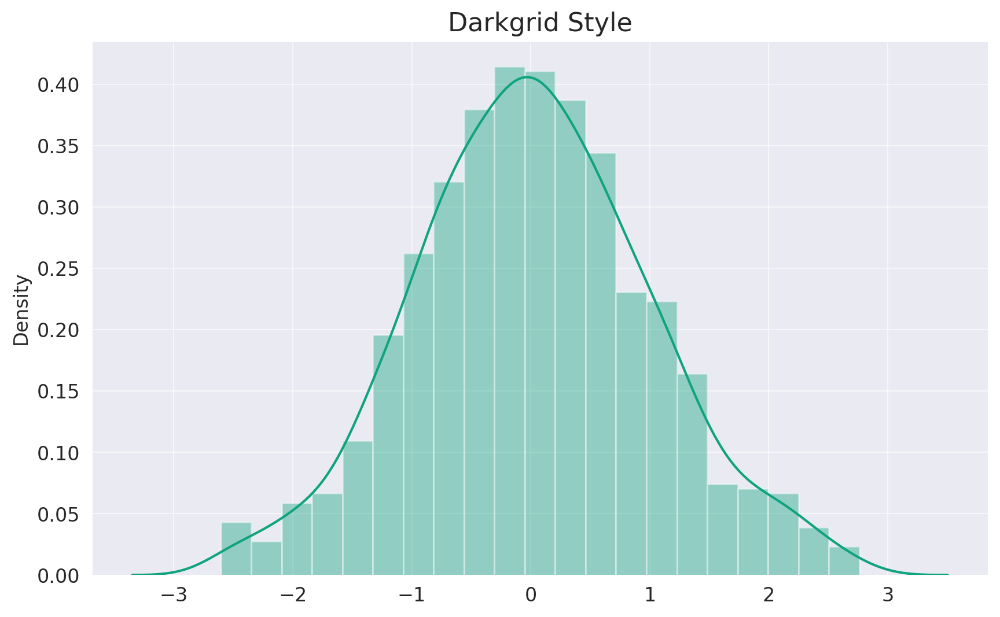
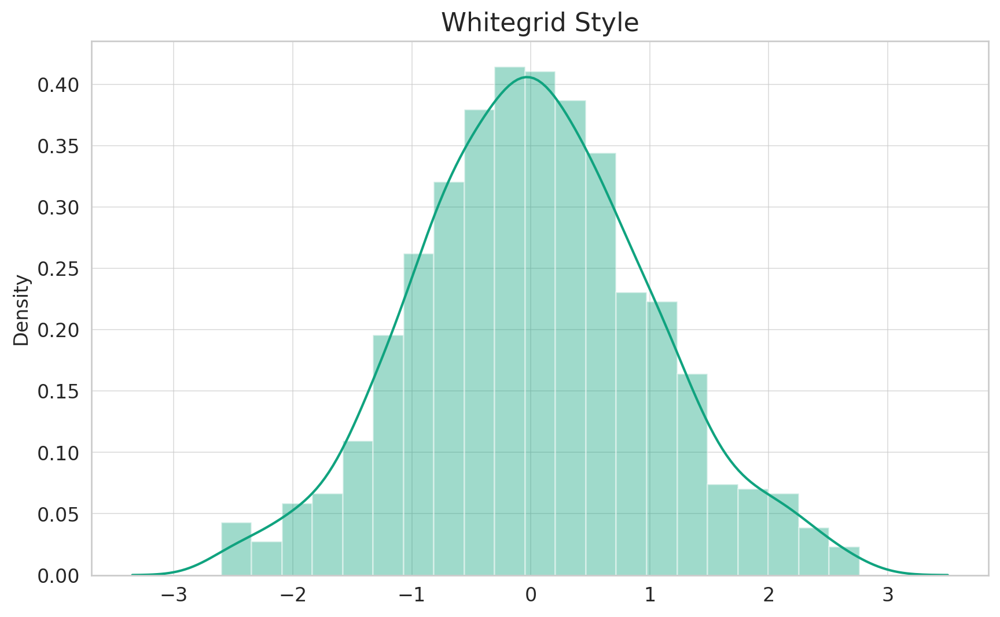
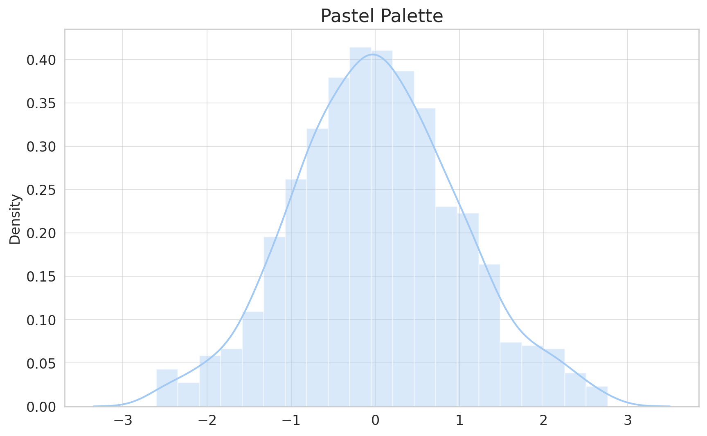
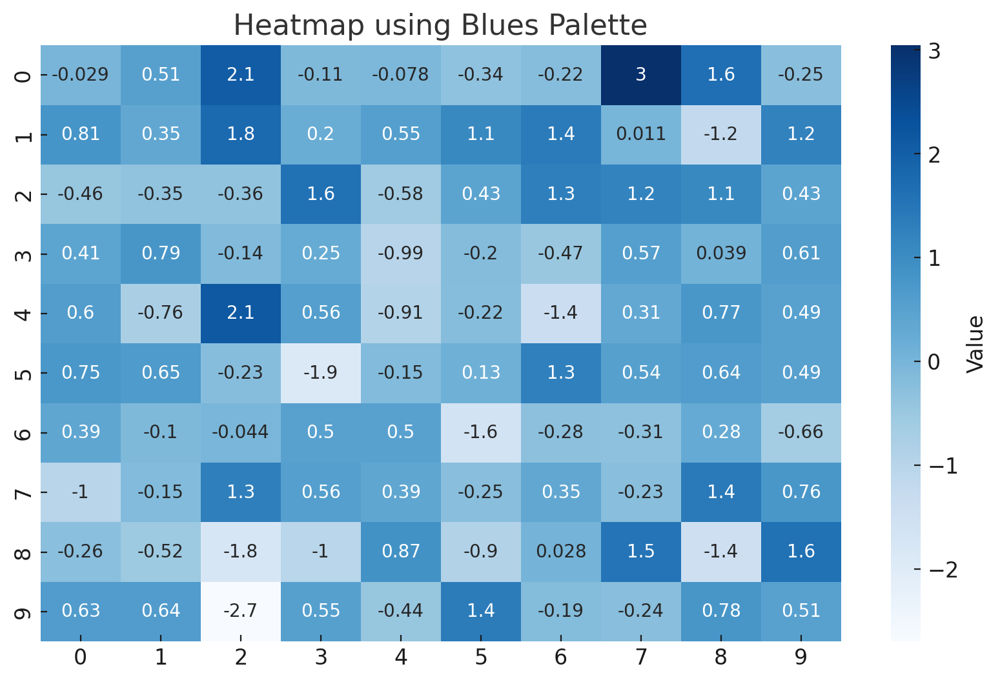
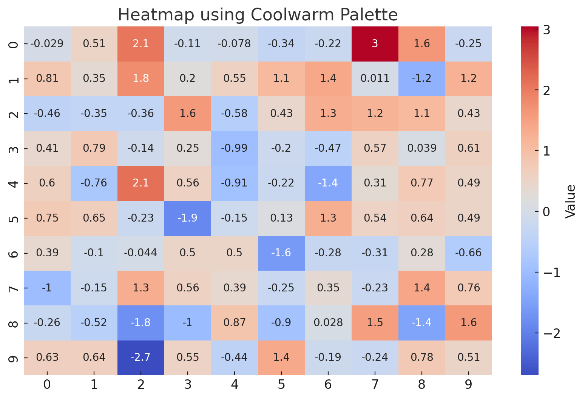

# Seaborn: Styling & Paletts


## **Styling**

### **Setting the Atmosphere with Seaborn Styles**

Seaborn offers a variety of built-in styles that set the aesthetic context for your plots, making it easier to tailor your visualizations to your audience and the context of your data presentation.

#### **1. Darkgrid (default)**

The default theme of Seaborn, it's suitable for most plots with white grid lines on a dark background.

```python
sns.set_style("darkgrid")
sns.distplot(data)
plt.title("Darkgrid Style")

plt.show()
```

Let's visualize this style:



As showcased above, the **Darkgrid** style offers a sleek and modern look with white grid lines against a muted gray background. This style is especially effective for visualizations where gridlines aid in data interpretation.

* * *

#### **2. Whitegrid**

Similar to Darkgrid, but with a lighter background. This style is ideal for graphs where the gridlines need to stand out while keeping the plot neutral.

```python
sns.set_style("whitegrid")
sns.distplot(data)
plt.title("Whitegrid Style")

plt.show()
```

Let's visualize the "Whitegrid" style:



The **Whitegrid** style, as illustrated above, offers a crisp backdrop with distinct grid lines. It strikes a balance between the starkness of a pure white background and the guidance grid lines provide, making it ideal for plots where the data and the grid are of equal significance.

* * *

### **Other Styles**

Seaborn also offers other styles like `dark`, `white`, and `ticks`. These styles give different visual experiences, and the choice depends on the specific context and preference of your data presentation.

* * *

## **Palettes**

### **Painting with Seaborn's Color Palettes**

Choosing the right color palette is paramount, as colors can influence data interpretation and the overall aesthetic of the plot. Seaborn offers a variety of palettes that cater to different visualization needs.

#### **1. Qualitative Palettes**

These palettes are suitable for categorical datasets where colors don't imply any order or value.

One popular option is the `pastel` palette:

```python
sns.set_palette("pastel")
sns.distplot(data)
plt.title("Pastel Palette")

plt.show()
```

Let's visualize this palette:



As depicted above, the **Pastel** palette offers muted, soft colors, perfect for visualizations that require a subtle, gentle touch. This palette is especially favored in contexts where bright, bold colors might be too overpowering.

* * *

#### **2. Sequential Palettes**

Sequential palettes are suitable for data ranges that have a clear start and endpoint, often used for numerical data.

A popular option is the `Blues` palette:

```python
# Display the Blues palette
sns.palplot(sns.color_palette("Blues", 10))
plt.title("Blues Palette")
plt.show()
```

Let's visualize this palette:



The **Blues** palette, as showcased above, uses a gradient of blue shades, transitioning from light to dark. It's ideal for visualizations that depict increasing or decreasing values, with the color intensity representing data magnitude.

* * *

#### **3. Diverging Palettes**

Diverging palettes are perfect for data where both the low and high extremes are significant.

A popular choice is the `coolwarm` palette:

```python
import numpy as np

# Generate random data for heatmap
data = np.random.randn(10, 10)

# Plot heatmap using the coolwarm palette
plt.figure(figsize=(10, 6))
sns.heatmap(data, cmap="coolwarm", annot=True, cbar_kws={'label': 'Value'})
plt.title("Heatmap using Coolwarm Palette")
plt.show()
```

Let's visualize this palette:



The **Coolwarm** palette, as illustrated above, transitions between cool and warm shades. This palette effectively captures both ends of a spectrum, making it ideal for datasets where you want to emphasize divergence or contrast between data points.

* * *

## **Conclusion**

The beauty of Seaborn doesn't just lie in its ability to create intricate plots, but also in its prowess to make them visually stunning. Through Seaborn's diverse styling options and color palettes, every visualization can be tailored to convey data insights with aesthetic finesse. Remember, the best visualizations are not just informative but also engaging, and with Seaborn, you're well-equipped to achieve both. Dive into the world of data visualization with confidence, and let your plots narrate compelling data stories!

---

!!! note "Version 1.0"

    This is currently an early version of the learning material and it will be updated over time with more detailed information.

    A video will be provided with the learning material as well.

    Be sure to subscribe to stay up-to-date with the latest updates.

<div style="padding: 20px; color: white; background-color: #0f1624; border-radius: 10px; margin: 10px 0 20px 0; text-align: center;">
    <h2 style="color: white;">Need help mastering Machine Learning?</h2>
    <p style="font-size: 16px;">Don't just follow along — join me!
    Get exclusive access to me, your instructor, who can help answer any of your questions. Additionally, get access to a private learning group where you can learn together and support each other on your AI journey.
    </p><br>
    <div style="text-align: center; margin-bottom: 20px;">
        <button style="display: inline-block; padding: 10px 20px; font-size: 20px; color: white; background: #1018A8; border: none; border-radius: 5px;">
            <a href="/subscribe" style="color: white; text-decoration: none;">Subscribe Now</a>
        </button>
    </div>
</div>