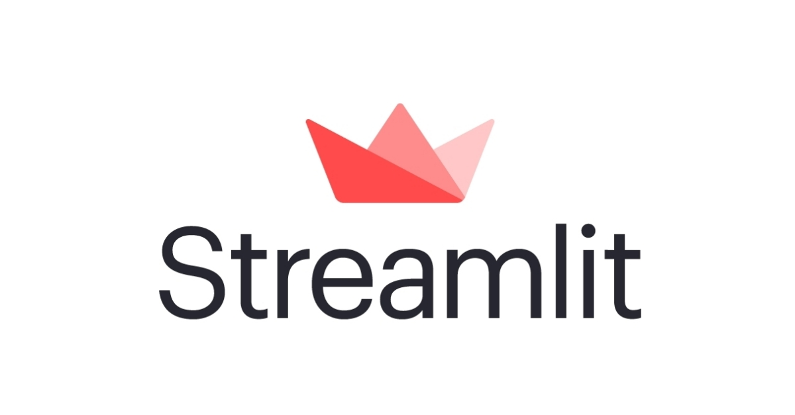

# Streamlit



## **Why Streamlit is Revolutionizing the Machine Learning Landscape**

In the dynamic world of machine learning, developing a model is only half the battle. Presenting and deploying these models in an interactive, user-friendly manner is equally crucial. Streamlit emerges as a frontrunner in this space, providing an intuitive platform for ML professionals to turn data scripts into shareable web apps in mere minutes.

### **What is Streamlit?**

Streamlit is an open-source Python library designed to help data scientists and engineers effortlessly create custom web apps for machine learning and data analysis. It blends the simplicity of writing Python scripts with the capability to produce interactive web applications without the need for extensive web development knowledge.

### **Streamlit's Unique Selling Proposition**

In an age where deploying machine learning models can be a complex task, Streamlit offers a beacon of simplicity. With its Python-centric approach, it eliminates the need to juggle between different languages or frameworks, enabling ML professionals to focus on what they do best.

## **Core Features of Streamlit**

### **Rapid Prototyping**

Streamlit's architecture is designed for speed. You can instantly see changes in your app as you modify the code. This live-coding ability ensures that prototyping becomes a fast and iterative process.

### **Native Python Integration**

No need to switch hats! Streamlit apps are written with pure Python. Whether it's data manipulation with Pandas, visualization with Matplotlib, or ML with TensorFlow, Streamlit integrates seamlessly.

### **Interactive Widgets**

Without writing a backend, Streamlit allows you to add interactive sliders, buttons, and input boxes, enhancing user experience and facilitating real-time model interactions.

### **Data Integration**

Streamlit can effortlessly integrate with various data sources, be it databases, cloud storage, or real-time data streams. Displaying and manipulating this data in your app is straightforward and intuitive.

## **Building Your First Streamlit App**

### **Installation**

Kickstarting your journey with Streamlit is as simple as running a pip command:

```bash
pip install streamlit
```

### **Crafting a Basic App**

Imagine creating an app that showcases a machine learning model without the hassle of web development. With Streamlit, this dream becomes a reality:

```python
import streamlit as st

st.title('My First Streamlit App')

user_input = st.text_input("Enter some text")
st.write(f'You entered: {user_input}')
```

Running the script with `streamlit run your_script_name.py` will launch a web app with your content.

## **Optimizing Machine Learning with Streamlit**

### **Model Visualization**

Streamlit seamlessly integrates with visualization libraries, allowing you to plot model metrics, data distributions, or any relevant insights with ease.

### **Real-time Predictions**

Incorporate interactive widgets to let users input data and see model predictions in real-time. This dynamic interaction makes model demonstrations more engaging and informative.

### **Model Versioning**

As models evolve, Streamlit apps can be easily updated to reflect changes, ensuring stakeholders always have access to the latest iterations.

## **Best Practices for Streamlit in Machine Learning**

### **State Management**

While Streamlit's stateless nature ensures simplicity, managing state for complex apps is crucial. Utilize Streamlit's session state capabilities to manage user inputs, variable values, or model states effectively.

### **Component Reusability**

As your app grows, consider modularizing your code. Create reusable Streamlit components to ensure your codebase remains organized and maintainable.

### **Secure Deployment**

When deploying Streamlit apps, especially those with sensitive data or models, ensure you follow security best practices. Consider using tools like Streamlit sharing, Streamlit for Teams, or third-party platforms for secure and scalable deployments.

## **Conclusion**

In the intersection of machine learning and application development, Streamlit shines brightly. It offers a refreshing approach, prioritizing simplicity without compromising on capability. For budding and seasoned machine learning professionals alike, Streamlit can be the bridge that transforms intricate models into interactive masterpieces. Dive into the world of Streamlit and experience the future of machine learning application development firsthand.

---

!!! note "Version 1.0"

    This is currently an early version of the learning material and it will be updated over time with more detailed information.

    A video will be provided with the learning material as well.

    Be sure to subscribe to stay up-to-date with the latest updates.

<div style="padding: 20px; color: white; background-color: #0f1624; border-radius: 10px; margin: 10px 0 20px 0; text-align: center;">
    <h2 style="color: white;">Need help mastering Machine Learning?</h2>
    <p style="font-size: 16px;">Don't just follow along — join me!
    Get exclusive access to me, your instructor, who can help answer any of your questions. Additionally, get access to a private learning group where you can learn together and support each other on your AI journey.
    </p><br>
    <div style="text-align: center; margin-bottom: 20px;">
        <button style="display: inline-block; padding: 10px 20px; font-size: 20px; color: white; background: #1018A8; border: none; border-radius: 5px;">
            <a href="/subscribe" style="color: white; text-decoration: none;">Subscribe Now</a>
        </button>
    </div>
</div>